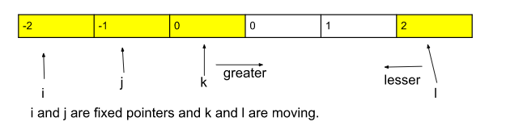

# [1572. Matrix Diagonal Sum](https://leetcode.com/problems/matrix-diagonal-sum/)

## Approach->
- There is an observation that the the middle cell will only collide in case of the matrix size being in odd number. For example, if the matrix is 3x3 then the middle cell will be the same for both sides diagonal. But in the case of a 4x4 matrix that is not the case. So traverse the diagonals and keep calculating the sum. If the matrix is odd then subtract the middle element from the final answer.

## Code->
```cpp
int diagonalSum(vector<vector<int>>& mat) {
        int size = mat.size();
        int ans = 0;
        for(int i=0; i<size; i++){
            ans+=mat[i][i]; // calculating sum for diagonal left to right
            ans+=mat[i][size-i-1]; // for diagonal right to left
        }
        if(size%2){
            ans -= mat[size/2][size/2];
        }
        return ans;
    }
```

# [42. Trapping Rain Water](https://leetcode.com/problems/trapping-rain-water/)
## Approach->
- If you notice closely then at any position the amount of water that can be stored is the [min( greatest height at the left, greatest height at the right) - height at the current position]. So brute force would be to traverse at the left and right from  a position and find the greatest at the left and right. TC -> O(n^2).
- You can maintain a prefix and suffix sum using hashing. That way you can easily find the greatest on the left and right. TC-> O(n). SC->O(n).
```cpp
int trap(vector<int>& height) {
        vector <int> prefix(height.size(), 0);
        vector <int> suffix(height.size(), 0);
        int premax = 0;

        // making a prefix array.
        for(int i=0; i<height.size(); i++){
            int curr = height[i];
            premax = max(premax, curr);
            prefix[i] = premax;
        }
        int sufmax = 0;

        // making a suffix array
        for(int i=height.size()-1; i>=0; i--){
            int curr = height[i];
            sufmax = max(sufmax, curr);
            suffix[i] = sufmax;
        }
        // finding ans
        int ans = 0;
        for(int i=0; i<height.size(); i++)
            ans += min(prefix[i], suffix[i]) - height[i];
        
        return ans;
    }
```
- The most optimal solution would be the two-pointer solution. So we will first discuss the solution and then discuss the intuition behind it. We will keep two pointers l and r on the left and right end of the array. Take two variables leftMax and rightMax and initialize them to 0. If height[l] is less than or equal to height[r] then if leftMax is less than height[l] update leftMax to height[l] else add leftMax-height[l] to your final answer and move the l pointer to the right i.e l++. If height[r] is less than height[l], then now we are dealing with the right block. If height[r] is greater than rightMax, then update rightMax to height[r] else add rightMax-height[r] to the final answer. Now move r to the left. Repeat these steps till l and r crosses each other. Now the intuition behind this approach is that we should subtract the current height with he min bw leftmax and rightmax height. So when we are selecting the position in the first if statement that we are dealing with we are making sure that it is the smaller height bw the left and the right pointer. This always makes sure that we are taking the smaller height bw the two heights. Look at the solution and think about it to understand properly
```cpp
int trap(vector<int>& height) {
        int l = 0;
        int r = height.size()-1;
        int leftmax = 0;
        int rightmax = 0;
        int ans = 0;

        while(l<r){ // do this till left is smaller than right pointer
            if(height[l]<=height[r]){ // we will select the position that we are dealing with as the smaller height bw the left and the right pointer so that we are always sure that we are dealing with the smaller height so that the water cannot ever overflow.
                if(height[l]<leftmax){
                    ans+=leftmax-height[l];
                }
                else{
                    leftmax = height[l];
                }
                l++;
            }
            else{
                if(height[r]<rightmax){
                    ans+=rightmax-height[r];
                }
                else{
                    rightmax = height[r];
                }
                r--;
            }
        }
        return ans;
    }
```
If you still didn't understand the solution just look at striver's solution with patience and you will be able to understand.

# [54. Spiral Matrix](https://leetcode.com/problems/spiral-matrix/)

[Dry run this diagram to understand the intuition and approach](https://www.youtube.com/clip/Ugkx_pJWYKBCRcyxe8XBNIXJa_Ios62CkcPt)

note: make a 4x4 matrix in the interview before coming up with this approach.
note: code this if possible cause you can make mistakes while coding this.

## Approach ->
Create 4 variables that will track the left,right,top and bottom position indexes so that they remain in the range. We will traverse the matrix until left<=right and top<=bottom.
	Left to right traversal:
	We will traverse all the columns keeping the top index fixed
	```
    for(int i=left; i<=right; i++)
            {
                res.push_back(matrix[top][i]);
            }
    ```

	we will increment the top variable top++;
	
	top to bottom traversal:
	We will traverse all the rows (top to bottom) keeping the right index fixed
	```
    for(int i=top; i<=bottom; i++)
            {
                res.push_back(matrix[right][i]);
            }
	right++;
	```

	NOTE: CHECK HERE THAT TOP<=BOTTOM because if you dry run the diagram you will see that left->right and top->bottom is always possible but after that there might be a case that every element is exhausted so we must have a check here.
	
	right to  left traversal:
	We will traverse all the rows (right to  left) keeping the bottom index fixed
    ```
	for(int i=right; i>=left; i++)
            {
                res.push_back(matrix[bottom][i]);
            }
	bottom++;
    ```

	NOTE: CHECK HERE THAT LEFT<=RIGHT
	bottom to up traversal:
	We will traverse all the rows (bottom to up) keeping the left index fixed
    ```
	for(int i=bottom; i>=up; i++)
            {
                res.push_back(matrix[left][i]);
            }
	left++;
    ```
	
## Code ->
```cpp
class Solution {
public:
    vector<int> spiralOrder(vector<vector<int>>& matrix)     {
        vector <int> ans;
        
        int left = 0;
        int right = matrix[0].size()-1;
        int bottom = matrix.size()-1;
        int top = 0;
        
        while(left<=right && top<=bottom){
            for(int i=left; i<=right; i++) // note the for loop here is going forward
                ans.push_back(matrix[top][i]); // note here we are writing matrix[top][i]
            top++;
            
            for(int i=top; i<=bottom; i++)
                ans.push_back(matrix[i][right]); // but note here we are writing matrix[i][right]
            right--;
            
            if(top<=bottom){ // here we are checking for top and bottom and not left and right because we will get an edge case if there is only one row or one column
                for(int i=right; i>=left; i--) // note the for loop here is going backwards
                    ans.push_back(matrix[bottom][i]);
                bottom--;
            }
            
            if(left<=right){
                for(int i=bottom; i>=top; i--)
                    ans.push_back(matrix[i][left]);
                left++;
            }
            
        }
        
        return ans;
    }
};
```

# [73. Set Matrix Zeroes](https://leetcode.com/problems/set-matrix-zeroes/)
## Approaches ->
1. Make a duplicate vector and traverse in the first vector and make rows and columns of duplicate matrix 0.
2. Ask the interviewer if the values in the matrix are non-negative or not. If the values are non-negative, you can tell the following approach -> Visit every element of the array. If an element is 0 then make its row and column elements as -1 but don't make the row and column elements -1 if its 0 too (because this 0 might change the values of other elements). After this is done, visit every element of the array again and make all the -1s as 0. [TC -> (N*M) * (N+M)] i.e. N*M for traversal in N*M vector and N+M for traversing the rows and columns of each 0 element. [SC -> O(1)].
3. Hashing -> Create two vectors of size N and M respectively. Mark the row and column as 0 if there is a 0 in the main array. Accordingly convert the main array to 0s by looking at the two vectors. [TC -> O(N*M + N*M)] [SC -> O(N + M) for taking two dummy vectors]. Note-> Tried this approach after a year but the mistake I did is assume that the size of row and col will be the same and took just one hash table. Don't repeat that in the interview
4. Optimisation of 2nd approach ->  Consider the 0th row and 0th col to be the hashes for the given array. Make two variables row and col and set them to false. Check if the 0th row or the 0th col has any 0s in it. If yes then mark row or col as true. Now consider the 0th row and 0th column as the hash for the remaining array and apply the 3th approach for the remaining array. At the end check if row is true then make the entire 0th row as 0 and do the same for col. Note-> When I solved using this approach after 1 year I applied too much brain. Just simply run all the loops like in example, don't reverse the positions of i and j like don't make matrix[i][0] as matrix[0][I]

## Code ->
```cpp
class Solution {
public:
    void setZeroes(vector<vector<int>>& matrix) {
        bool isrow = false;
        bool iscol = false;
        
        for(int i=0; i<matrix[0].size(); i++){
            if(matrix[0][i]==0) isrow=true;
        }
        for(int i=0; i<matrix.size(); i++){
            if(matrix[i][0]==0) iscol=true;         
        }
        
       for(int i=1; i<matrix.size(); i++){
           for(int j=1; j<matrix[0].size(); j++){
               if(matrix[i][j]==0)
               {
                   matrix[0][j]=0;
                   matrix[i][0]=0;
               }
           }
       }
        
        for(int i=1; i<matrix[0].size(); i++){
            if(matrix[0][i]==0){
                for(int j=0; j<matrix.size(); j++){
                    matrix[j][i]=0;
                }
            }
        }
        for(int i=1; i<matrix.size(); i++){
            if(matrix[i][0]==0){
                for(int j=0; j<matrix[0].size(); j++){
                    matrix[i][j]=0;
                }
            }
        }
        
        if(isrow){
            for(int i=0; i<matrix[0].size(); i++)
                matrix[0][i]=0;
        }
        if(iscol){
            for(int i=0; i<matrix.size(); i++)
                matrix[i][0]=0;
        }
    }
    
};
```

# [31. Next Permutation](https://leetcode.com/problems/next-permutation/)
## Code->
```cpp
class Solution {
public:
    void nextPermutation(vector<int>& nums) {
        //1 3 5 4 2
        // ans -> 1 4 2 3 5
        // First take index=-1 and we iterate backwards in the vector. If we encounter the order from backwards to be descending at any point, we store that index in "index". eg. in 1 3 5 4 2 if we move from the back, we get 2 4 5 (increasing) 3 (decreasing).. as soon as we get 3 we store its index. 
        int index=-1;
        for(int i=nums.size()-2; i>=0; i--){
            if(nums[i]<nums[i+1]){
                index = i;
                break;
            }
        }
        
         
        // if there is no decreasing order from the back, that means that the vector is already lexicographically greatest. In that case atq we return lexicographically smallest vector.
        if(index==-1){
            reverse(nums.begin(), nums.end());
            return;
        }
        // We go from back again and see if there is any number greater than the number on "index"'s index, and we swap them.
        for(int i=nums.size()-1; i>=0; i--){
            if(nums[i]>nums[index]){
                swap(nums[i], nums[index]);
                break;
            }
        }
        // at the end we will also reverse the array from index+1 beacause we have already created a lexicographically greater order by swapping position index with i, but we need to make the order from index+1 as lexicographically smallest so that the overall order is next lexicographically greater order. 
        reverse(nums.begin()+index+1, nums.end());
    }
};
```
# [74. Search a 2D Matrix](https://leetcode.com/problems/search-a-2d-matrix/description/)

## Approaches ->
1. Brute Force - Traverse in O(n*m) TC and find the target.
2. Better Approach: Place yourself on either the top right or bottom left cornor, that way when you go to your left the elements decrease and when you go down the elements increase. Using this you can find the target in O(n+m) TC.
3. Most Optimal: Treat 2D array as 1D array and perform Binary Search. TC -> O(log(n * m)). For that just take low = 0, mid = (low+high)/2 and high = m*n-1. To find the 2D element using this 1D mid, apply the formula -> `matrix[mid/n][mid%n]`

## Codes->
2.
```cpp
class Solution {
public:
    bool searchMatrix(vector<vector<int>>& matrix, int target) {
        int row = 0, col = matrix[0].size()-1;

        while(row<matrix.size() && col>=0){
            if(matrix[row][col]==target) return true;
            else if(matrix[row][col]>target) col--;
            else row++;
        }
        return false;
    }
};
```
3. 
```cpp
class Solution {
public:
    bool searchMatrix(vector<vector<int>>& matrix, int target) {
        int m = matrix.size(), n = matrix[0].size();
        int low = 0, mid, high = m*n - 1;

        while(low <= high){
            mid = (low+high)/2;

            int element = matrix[mid/n][mid%n];

            if(element == target) return true;
            else if(element < target) low = mid+1;
            else high = mid-1;
        }
        return false;
    }
};
```

# [240. Search a 2D Matrix II](https://leetcode.com/problems/search-a-2d-matrix-ii/description/)
## Approach ->
The approach 2 of the above question works here.

# [769. Max Chunks To Make Sorted](https://leetcode.com/problems/max-chunks-to-make-sorted/)
## Approach-> 
In the question the condition says that there will be elements from 0 to n-1. Approach is very simple yet multiple wrong approaches might come to your head while solving this problem. The correct approach is that you maintain a maximum element while traversing in the array. If the maximum element found till time is equal to i then that is one chunk. The intuition is that each chunk must have one condition that the last element of the chunk must be equal to i. And at the same time there should not be any element in that chunk that is greater than the last element because if that's the case then even if we sort that chunk the elements will not be arranged in the right order because there is one element that is greater than everything else and we must have the greatest element found till time equal to i.
## Code->
```cpp
class Solution {
public:
    int maxChunksToSorted(vector<int>& arr) {
        int ans = 0, maxim=0;
        for(int i=0; i<arr.size(); i++){
            maxim = max(arr[i], maxim);
            if(maxim==i) ans++;
        }
        return ans;
    }
};
``` 

# [204. Count Primes](https://leetcode.com/problems/count-primes/)
## Approach -> 
Seive of Eratosthenes-> The idea is to assume that every number in the range 0 to n is a prime number. so mark them as true. Then traverse every number and traverse their table and keep marking the elements in their table as false. When you keep doing that till sq. root of n then we will acquire all the prime numbers and composite numbers in our hashtable. The solution given below is beautifully optimized too.. Try coding the approach and searching about the intution because coding it is kind of tough given if you make any little changes the test cases won't pass.
## Code->
```cpp
class Solution {
public:
    int countPrimes(int n) {
        if(n==0)  return 0;
        vector<bool> prime(n, true);
        prime[0] = false, prime[1] = false;
        for (int i = 0; i < sqrt(n); ++i) {
            if (prime[i]) {
                for (int j = i*i; j < n; j += i) { // note below
                    prime[j] = false;
                }    
            }    
        }
        return count(prime.begin(), prime.end(), true);
    }
    
};

// note: instead of i*i you can write i*2 as well but i*i is more efficient. Numbers smaller than i * i would have been already marked as not prime by the time we reach i.
```
TC-> O(n*log(log n))

# [118. Pascal's Triangle](https://leetcode.com/problems/pascals-triangle/)
## Approach ->
- Pretty easy approach. We will at least have numRows=1 according to the constraints. So just make a vector of vector ans and push back 1 in it. We can also observe that no matter what the row number is, it's first and the last elements are always 1. So run a loop from 1 to numRows-1 and on each iteration push back 1 at the start and end. And in the middle observe how the value is the sum of the values of the above two indexes.
---
## Code ->
```cpp
vector<vector<int>> generate(int numRows) {
        vector<vector<int>> ans(numRows);
        ans[0].push_back(1);
        for(int i=1; i<numRows; i++){
            ans[i].push_back(1);
            for(int j=1; j<i; j++){
                ans[i].push_back(ans[i-1][j-1] + ans[i-1][j]);
            }
            ans[i].push_back(1);
        }

        return ans;
    }
```
# [53. Maximum Subarray](https://leetcode.com/problems/maximum-subarray/description/)

## Approach ->
Kadane's Algorithm

---

## Code ->
```cpp
class Solution {
public:
    int maxSubArray(vector<int>& nums) {
        int ans = nums[0];
        int sum = 0;

        for(int i=0; i<nums.size(); i++){
            sum+=nums[i];
            ans = max(sum, ans);
            if(sum<0) sum = 0;     
        }
        return ans;
    }
};
```
# [75. Sort Colors](https://leetcode.com/problems/sort-colors/)

## Approaches ->
1. Sort the array
2. Count sort -> Count the no. of 0s 1s and 2s and print or return them in order.
3. DNF Algorithm -> Create low, mid and high. The intution is as follows -> After the DNF algo is applied - All of the elements to the left of low should be 0, all of the elements from low to mid-1 will be 1, all the elements between high and the extreme right should be 2. Let low and mid point to the first element and high point to last. The mid does all the traversing part.

So basically:
0 will be present from index 0 - low-1
1 will be present from index low - mid-1
2 will be present from index mid - n-1


Algo: Using mid when we encounter ->
```
0    ->    swap(arr[low], arr[mid];
           low++; mid++;

1    ->    mid++;

2    ->    swap(arr[high], arr[mid]);
           high--;

```
		repeat this process till mid crosses high.

---

## Code ->
```cpp
class Solution {
public:
    void sortColors(vector<int>& nums) {
        int low =0, mid=0, high=nums.size()-1;
        
        while(mid<=high){
            if(nums[mid]==0)
                swap(nums[low++], nums[mid++]);
            else if(nums[mid]==1)
                mid++;
            else swap(nums[high--], nums[mid]);
        }
    }
};
```

# [121. Best Time to Buy and Sell Stock](https://leetcode.com/problems/best-time-to-buy-and-sell-stock/description/)

## Approaches->
1. Maintain a lmin and rmax hashtable where we store min elements from left and max elements from right respectively. Reverse the rmax. Then return the maximum difference between lmin and rmax at each index. That's your answer. SC-> O(n) TC-> O(n)

2. Keep a minimum to store minimum price and a maximum to store maximum profit. Traverse the array, if the visited element is smaller than minimum price then update the min price and move on. Else compare the profit (p = price[i] - minNum) with max profit and update max profit.

---
## Code ->
```
class Solution {
public:
    int maxProfit(vector<int>& prices) {
        int maxProfit = 0; // don't ever make this as INT_MIN, the least profit you can have is 0
        int minP = prices[0];

        for(int i=1; i<prices.size(); i++){
            minP = min(minP, prices[i]);
            maxProfit = max(maxProfit, prices[i]-minP); 
        }

        return maxProfit;
    }
};
```

# [122. Best Time to Buy and Sell Stock II](https://leetcode.com/problems/best-time-to-buy-and-sell-stock-ii/description/)

## Approaches ->
1. Brute Force
2. Only buy on a day if you can make profit on the next day else don't.
---
## Code ->
```cpp
class Solution
{
public:
    int maxProfit(vector<int> &prices)
    {
        int totalProfit=0;
        for(int i=1; i<prices.size(); i++){
            if(prices[i] > prices[i-1])
            {
                totalProfit += prices[i] - prices[i-1];
            }
        
        }
        return totalProfit;
    }
};
```
# [48. Rotate Image](https://leetcode.com/problems/rotate-image/description/)
## Approaches ->
1. Brute force -> Take another dummy matrix of n*n, and then take the first row of the matrix and put it in the last

2. Optimized (In place) -> By observation, we see that the first column of the original matrix is the reverse of the first row of the rotated matrix, so that’s why we transpose the matrix and then reverse each row, and since we are making changes in the matrix itself space complexity gets reduced to O(1).
---

## CODE -> 
```
void rotate(vector<vector<int>>& matrix) {
        // Transpose of matrix (Try this on your own first)
        for(int i=0; i<matrix.size(); i++)
            for(int j=i; j<matrix[0].size(); j++)  // note how j=i
                swap(matrix[i][j], matrix[j][i]);
        // Reverse the matrix
        for(int i=0; i<matrix.size(); i++){
            int x = 0;
            int y = matrix[0].size()-1;
            while(x<y) swap(matrix[i][x++], matrix[i][y--]);
        }
    }
```

# [56. Merge Intervals](https://leetcode.com/problems/merge-intervals/description/)

## Approach ->
First we will sort the array so that we have it sorted by the first element of all the vectors inside the vector. Now the intuition is that we will insert the first element in the answer vector and as we traverse we can find two different cases:
Case 1: If the current interval can be merged with the last inserted interval of the answer vector:
In this case, we will update the end of the last inserted interval with the maximum(current interval’s end, last inserted interval’s end) and continue moving afterward. 

Case 2: If the current interval cannot be merged with the last inserted interval of the answer vector:
In this case, we will insert the current interval in the answer array as it is. And after this insertion, the last inserted interval of the answer list will obviously be updated to the current interval. 

How to check if the current interval is not a part of the selected interval:
We will compare the current interval’s start with the end of the selected interval. If the start is greater than the end, we can conclude the current interval cannot be a part of the selected interval.

Do see the code properly because it is an beautiful example of how to use vec.back().

```cpp
class Solution {
public:
    vector<vector<int>> merge(vector<vector<int>>& intervals) {
        vector<vector<int>> ans;
        sort(intervals.begin(), intervals.end()); // sort the intervals
        for(int i=0; i<intervals.size(); i++){
            if(ans.empty() || ans.back()[1]<intervals[i][0])  // if first element or case 2
                ans.push_back(intervals[i]);
            else // case 1
                ans.back()[1] = max(ans.back()[1],intervals[i][1]); // insert the max of last element
        }
        return ans;
    }
};
```

# [88. Merge Sorted Array](https://leetcode.com/problems/merge-sorted-array/description/)

## Approaches ->
- Put elements of nums2 in nums1 at the end and sort nums1. [TC->(N+M)log(N+M), SC->1]
- Put a pointer at nums1's start and another at nums2's start and put the elements in a sorted manner in a third array and return the third array. [TC->N+M, SC->N+M]
- The idea is to take advantage of sorted nums1 and nums2. Dry run the code to understand first because this explanation in more complex than the code itself lol. Put a pointer 'a' at position m-1 of nums1 and a pointer 'b' at position n-1 of nums2. Put a pointer 'i' at the end of nums1 i.e. n+m-1 position. Now we can compare if nums1[a] is greater than nums2[b] then place the value of nums1[a] at the end of nums1 i.e. nums1[i] and then do a-- and i--. If nums2[b] is greater than nums1[a] then place the value of nums2[b] at nums1[i] and then do b-- and i--. Please keep in mind that it is possible that at the end we might have travelled for the entire nums1 but there might be elements left in nums2, so to tackle that we place all the values inside nums2 in nums1 with another while loop. [TC->N+M, SC->1]

---
## Code ->
```cpp
class Solution {
public:
    void merge(vector<int>& nums1, int m, vector<int>& nums2, int n) {
        int a = m-1;
        int b = n-1;
        int i = m+n-1;
       
        while(a>=0 && b>=0){
            if(nums1[a]>nums2[b]) nums1[i--] = nums1[a--];
            else nums1[i--] = nums2[b--];
        }
        while(b>=0)
            nums1[i--] = nums2[b--];
    }
};
```
# [287. Find the Duplicate Number](https://leetcode.com/problems/find-the-duplicate-number/description/)

## Approaches ->
1. Brute Force. TC -> O(N^2)
2. Sort the array. Find dupl. [TC -> O(log N)]
3. Using Set -> After insertion of the elements in set, if the size did not increase then the element is dupl. TC -> O(N), SC -> O(N)
4. Swap sort.

---
## Code ->

Swap sort ->
```cpp
class Solution {
public:
    int findDuplicate(vector<int>& nums) {
        int i = 0;
        int ans=0;
        int sze = nums.size();
        while(i<sze)
        {
            if(nums[i]!=i+1 )
            {
              if(nums[i] == nums[nums[i]-1])
                    return nums[i];
                else
                    swap(nums[i], nums[nums[i]-1]);
            }
            else
                i++;
        }

        return ans;
    }
};
```
# [169. Majority Element](https://leetcode.com/problems/majority-element/description/)

## Approach->
- Sort the array. If any element occur size/2+1 times then that is the ans. Or the element that is in the center of the array is the ans.
- Make a map and find the occurrence of each elem.
- Maintain a majorityElement integer and a count integer to count the frequency.  Go to every element and if the count is 0 then assume that the present element is majorityElement. If the present element is equal to majorityElement then increase the count else decrease the count. This is based on the fact that the majority element will always kill the frequency of all the other elements by atleast 1. Look at the code now you will understand the approach.

---
## Code ->

```cpp
class Solution {
public:
    int majorityElement(vector<int>& nums) {
        int count=0, ele=0;
        for(int i=0; i<nums.size(); i++){
            if(count==0) ele=nums[i];
            if(ele==nums[i]) count++;
            else count--;             
        }
        return ele;
    }
};
```
# [229. Majority Element II](https://leetcode.com/problems/majority-element-ii/description/)

## Approaches->
- Brute Force
- Hashmap

- Best approach-> 

So for this we use extended version of Boyer Moore’s Voting Algorithm. Since the majority element occurs more than n/3 times, there can be either 0, 1 or even 2 majority element. So we will keep track of 2 majority elements with some conditions. And at the end check the occurrence of both the elements, if they are majority elements then include them in our answer vector. Here's the approach: 

1. Initialize 4 variables:
cnt1 & cnt2 –  for tracking the counts of elements
el1 & el2 – for storing the majority of elements.
2. Traverse through the given array.
    - If cnt1 is 0 and the current element is not el2 then store the current element of the array as el1 along with increasing the cnt1 value by 1.
    - If cnt2 is 0 and the current element is not el1 then store the current element of the array as el2 along with increasing the cnt2 value by 1.
    - If the current element and el1 are the same increase the cnt1 by 1.
    - If the current element and el2 are the same increase the cnt2 by 1.
    - Other than all the above cases: decrease cnt1 and cnt2 by 1.
3. The integers present in el1 & el2 should be the result we are expecting. So, using another loop, we will manually check their counts if they are greater than the floor(N/3).

---
## Code->
```cpp
class Solution {
public:
    vector<int> majorityElement(vector<int>& nums) {
        int c1=0, c2=0;
        int e1,e2;

        for(int i=0; i<nums.size(); i++){
            if(c1==0 && nums[i]!=e2){
                c1++;
                e1 = nums[i];
            }
            else if(c2==0 && nums[i]!=e1){
                c2++;
                e2 = nums[i];
            }
            else if(nums[i]==e1) c1++;
            else if(nums[i]==e2) c2++;
            else{
                c1--; c2--;
            }
        }

        vector <int> ans;
        c1=0; c2=0;
        for(int i=0; i<nums.size(); i++){
            if(nums[i]==e1) c1++;
            if(nums[i]==e2) c2++;
        }

        if(c1>nums.size()/3) ans.push_back(e1);
        if(c2>nums.size()/3) ans.push_back(e2);

        return ans;
    }
};
```

# [1. Two Sum](https://leetcode.com/problems/two-sum/description/)

## Approaches ->
- Brute Force TC->O(n^2)

- Two pointer -> Sort the array. We will keep a left pointer at the first index and a right pointer at the last index. Now until left < right, we will check the sum of arr[left] and arr[right]. Now if the sum < target, we need bigger numbers and so we will increment the left pointer. But if sum > target, we need to consider lesser numbers and so we will decrement the right pointer. 
If sum == target we will return the indices. TC-> O(n log n)

- Keep a hashmap where you store all the elements in the array. Traverse the array and do `toFind = target-arr[i]`. If you find `toFind` in the hashmap then you return their indices. But remember to insert in the hashmap in the same loop as you calculate the toFind to avoid duplicates. TC-> O(n) SC-> O(n). Also instead of using map use unordered_map so that the search TC of per element is O(1) instead of O(log n).

## Code -> 

3. 
```cpp
class Solution {
public:
    vector<int> twoSum(vector<int>& nums, int target) {
        unordered_map<int, int> prevElem;
        vector<int> ans;

        for(int i=0; i<nums.size(); i++){
            if(prevElem.contains(target-nums[i])){
                ans.push_back(prevElem[target-nums[i]]);
                ans.push_back(i);
                break;
            }
            prevElem[nums[i]] = i;
        }

        return ans;
    }
};
```

# [15. 3Sum](https://leetcode.com/problems/3sum/description/)

## Approaches->
- Brute force.

- Best approach is the combination of the better approach of 2 sum problem (sorting method) combined with the for loop for one extra element. Note that we must ask interviewer if duplicate ans is allowed. The interviewer will always say no, it's not allowed. Here's the steps to take->    
    - Sort the array to simplify traversal and avoid duplicate answers.
    - Use a for-loop to iterate over unique elements (nums[i]).
    - Inside the for loop, maintain two pointers (low and high) to find triplet sums equal to the negative of the current element.
    - Skip duplicate elements in the for-loop to avoid duplicate triplets.
    - Output the distinct triplets that satisfy the condition nums[i] + nums[low] + nums[high] == 0.

---

Read the code and the comments inside it because you are going to make some blunders in this code. The coding is tough here, not the approach, so practice before watching the sol, if possible. NAHH.. JUST SEEING THE SOL WON'T HELP, YOU HAVE TO SOLVE IT!

---
## Code->
```cpp
class Solution {
public:
    vector<vector<int>> threeSum(vector<int>& nums) {
        vector <vector <int>> ans;
        if(nums.size()<3) return ans; 

        // sort the array    
        sort(nums.begin(), nums.end()); 
       
        for(int i=0; i<nums.size()-2; i++){
            if(i && nums[i]==nums[i-1]) continue;
            // we want to ignore duplicate answers, that's why we will move for duplicate nums[i]. eg-> -1 -1 -1 2 3.. we will check for the first -1 and then jump i to 2. Note that we will not write the condition as- if(nums[i]==nums[i+1]) continue; This is because for the above example taken, we want the other -1s to survive, so if we did this then -1s in the start will not be counted and this will affect our answer, so we will always take the first -1 and not skip them, and only skip the next -1s.
           
            int lo = i+1, hi = nums.size()-1;   
            while(lo < hi){
                if(nums[i]+nums[hi]+nums[lo]==0){
                    // note how we take input in vector of vector.
                    ans.push_back({nums[i], nums[hi], nums[lo]});
                   
                    // we will also move the low and the high pointer if the elements on them is equal, this is to avoid duplicate answers. eg-> ...-1 2(low) 2 3 4 5 5(hi).. then we move like -> ..-1 2 2 3(low) 4(hi) 5 5.
                    lo++;
                    hi--;
                    while(lo<hi && nums[lo] == nums[lo-1]) lo++; //note the condition
                    while(lo<hi && nums[hi] == nums[hi+1]) hi--; //note the condition. These two loops are always written inside this if condition and not outside for the other two else if conditions, otherwise runtime error.
                    
                }
                else if(nums[i]+nums[hi]+nums[lo]>0) hi--;
                else lo++;     
            }
        }
        return ans;
    }
};
```

# [18. 4Sum](https://leetcode.com/problems/4sum/description/)

## Approaches ->
- Brute force - O(N^4)
- Sort the array. Run 3 for loops and then find the 4th element by finding it using binary search. - O(log N . N^3)
- This problem is an extension of 3Sum, which in turn extends 2Sum. The core strategy remains the two-pointer technique, but adapted for four numbers.

Key Steps:
- Fixing two numbers using two for-loops (i and j).
- Then using the two-pointer technique on the remaining part of the array (left and right).
This gives us better performance while also allowing us to efficiently skip duplicates. Look at the pointer placement in the diagram below.



Read the approach carefully, specially the "3. Skip Duplicates for i and j".

Approach->

1. Sort the Array: Sorting is important because it makes skipping duplicates easier and reliable.

2. Fix Two Numbers (i and j): i goes from 0 to n-4 and j goes from i+1 to n-3. This ensures we leave enough room for the other two elements (left and right).

3. Skip Duplicates for i and j: We don’t want to re-check combinations that we have already considered.

For i, use: if(i > 0 && nums[i] == nums[i-1]) continue;

For j, use: if(j > i+1 && nums[j] == nums[j-1]) continue;

Explanation:
Take nums = [1,1,1,2,2,3,4]. If we fix i = 0, we don’t want to consider i = 1 or i = 2 because it's the same number as before (1). Similarly for j. But we must not skip the first occurrence, so use i > 0 and j > i+1 respectively.

Explanation: j starts from 2nd index, which has element 1. But according to the logic of skip if nums[j]==nums[j-1], this 1 will be skipped. That's why we are using hte j>i+1 in the check first.

4. Apply Two-Pointer Search
left = j + 1, right = n - 1

5. Skip Duplicates for left and right
After finding a valid quadruplet, move left and right while skipping over duplicates:

while(left < right && nums[left] == nums[left - 1]) left++;

while(left < right && nums[right] == nums[right + 1]) right--;

---
## Code ->
```cpp
class Solution {
public:
    vector<vector<int>> fourSum(vector<int>& nums, int target) {
        vector<vector<int>> ans;
        if(nums.size()<4) return ans;

        sort(nums.begin(), nums.end());
        
        // First pointer (i) runs till n - 4
        for(int i=0; i<nums.size()-3; i++){
            // Skip duplicates for i
            if(i && nums[i]==nums[i-1]) continue;
            // Second pointer (j) starts from i + 1 and runs till n - 3
            for(int j=i+1; j<nums.size()-2; j++){
                // Skip duplicates for j except its first occurence
                if(j>i+1 && nums[j]==nums[j-1]) continue;

                int left = j+1;
                int right = nums.size()-1;

                while(left<right){
                    // Use long long to avoid integer overflow and add one by one for the same
                    long long sum = nums[i];
                    sum+=nums[j];
                    sum+=nums[left];
                    sum+=nums[right];

                    // If we found a valid quadruplet
                    if(sum == target){
                        ans.push_back({nums[i], nums[j], nums[left], nums[right]});
                        left++; right--;
                        // Skip duplicates for left and right
                        while(left<right && nums[left]==nums[left-1]) left++;
                        while(left<right && nums[right]==nums[right+1]) right--;
                    }
                    // If sum is greater than target, move right to get a smaller sum
                    else if(sum>target){
                        right--;
                        // Skip duplicates
                        while(left<right && nums[right]==nums[right+1]) right--;
                    }
                    // If sum is less than target, move left to get a bigger sum
                    else{
                        left++;
                        // Skip duplicates
                        while(left<right && nums[left]==nums[left-1]) left++;
                    }
                }
            }
        }
        
        return ans;
    }
};
```

[128. Longest Consecutive Sequence](https://leetcode.com/problems/longest-consecutive-sequence/description/)

## Approaches->

1. We can simply sort the array and run a for loop to find the longest consecutive sequence.

2. Using Set data structure - First, we will put all the array elements into the set data structure.
If a number, num, is a starting number, ideally, num-1 should not exist. So, for every element, x, in the set, we will check if x-1 exists inside the set. :
If x-1 exists: This means x cannot be a starting number and we will move on to the next element in the set.
If x-1 does not exist: This means x is a starting number of a sequence. So, for number, x, we will start finding the consecutive elements.
How to search for consecutive elements for a number, x:
Instead of using linear search, we will use the set data structure itself to search for the elements x+1, x+2, x+3, and so on.

Edge case - If there is no element in nums, return 0.

## Code->
```cpp
class Solution {
public:
    int longestConsecutive(vector<int>& nums) {
        if(nums.size()==0) return 0;
        unordered_set<int> st; // use unordered set
        int ans = 1;
        int count = 1;

        // insert all elements of array into the set
        for(int i=0; i<nums.size(); i++){
            st.insert(nums[i]);
        }

        // iterate in the set (not in the array because that will give TLE)
        for(auto elem: st){
            // if you find an element that is the starting element of a consecutive sequence, then proceed
            if(st.find(elem-1)==st.end()){
                elem++;
                while(st.contains(elem)){
                    count++;
                    elem++;
                } 
            }

            // compare ans and reset count variable.
            ans = max(ans, count);
            count = 1;
        }
        return ans;
    }
};
```
### Complexity Analysis->
Now think of the TC on your own. 

Time Complexity: O(N) + O(2*N) ~ O(3*N), where N = size of the array.
Reason: O(N) for putting all the elements into the set data structure. After that for every starting element, we are finding the consecutive elements. Though we are using nested loops, the set will be traversed at most twice in the worst case. So, the time complexity is O(2*N) instead of O(N^2).

Space Complexity: O(N), as we are using the set data structure to solve this problem.


# [Largest subarray with 0 sum](https://practice.geeksforgeeks.org/problems/largest-subarray-with-0-sum/1)

## Approaches ->
- Brute force: Check all subarrays and if their sum is 0 return the biggest one.
- Using prefix sum: let us understand the intuition->

There can be two cases that will give us our longest subarray with zero sum:

Case 1: If at any index the prefix sum is 0, it means the subarray from the start (index 0) to that index adds up to 0.
Array: 15, -2, 2, -8, 1, 7, -15, 5
Prefix Sums: 15, 13, 15, 7, 8, 15, 0, 5
Here, prefix sum becomes 0 at index 6 → that means the subarray from index 0 to 6 adds up to 0.
So the length is 7.

Case 2: If a prefix sum value repeats, it means the subarray between the first and second occurrence of that value has a sum of 0. Let's take an example
Array: 15, -2, 2, -8, 1, 7, 10
Prefix Sums: 15, 13, 15, 7, 8, 15, 25

Here, 15 appears at index 0, 2, and 5:
Between index 0 and 2: subarray -2, 2 → sum is 0
Between index 0 and 5: subarray -2, 2, -8, 1, 7 → sum is 0

So, the longest subarray with 0 sum is of length 5.


## Code ->
```cpp
class Solution {
  public:
    int maxLen(vector<int>& arr) {
        int largestSubarraySumZero = 0;
        int sum = 0;

        unordered_map<int, int> prefixSum; // Stores first occurrence of each prefix sum

        for(int i = 0; i < arr.size(); i++) {
            sum += arr[i];

            if(sum == 0) {
                largestSubarraySumZero = i + 1; // Subarray from 0 to i has sum 0
            } else {
                if(prefixSum.find(sum) != prefixSum.end())
                    largestSubarraySumZero = max(largestSubarraySumZero, i - prefixSum[sum]);
                else
                    prefixSum[sum] = i; // Store first occurrence
            }
        }

        return largestSubarraySumZero;
    }
};
```

# [Longest Subarray with Sum K](https://www.geeksforgeeks.org/problems/longest-sub-array-with-sum-k0809/1)
## Approach ->
✅ Case 1:
If the current prefix sum itself equals k, then the subarray from the start to current index is a valid candidate.
Array: [10, 5, 2, 7, 1, -10]
Prefix sum: [10, 15, 17, 24, 25, 15], k = 15
At index 5, sum is 15. So ans = 5.

✅ Case 2:
If the difference (prefix_sum - k) has appeared before in the map, it means:
The subarray between the previous occurrence of prefix_sum - k and current index has a sum = k.
We calculate its length and update the maximum.

Example:
Array: [1, 2, 3, 7, 5], k = 12
Prefix sum: 1, 3, 6, 13, 18
At index 3, prefix sum = 13.
13 - 12 = 1, and 1 exists in the map at index 0.
-> So, subarray from index 1 to 3 ([2, 3, 7]) has sum 12.
This is Case 2: prefix_sum - k is found in the map → subarray with sum = k exists.

## Code->
```cpp
class Solution {
  public:
    int longestSubarray(vector<int>& arr, int k) {
        int largestSubarraySumK = 0;
        int sum = 0;

        unordered_map<int, int> prefixSum;

        for(int i = 0; i < arr.size(); i++) {
            sum += arr[i];

            if(sum == k) {
                largestSubarraySumK = i + 1;
            } else if(prefixSum.find(sum - k) != prefixSum.end()) {
                largestSubarraySumK = max(largestSubarraySumK, i - prefixSum[sum - k]);
            }

            // Only store the first occurrence
            if(prefixSum.find(sum) == prefixSum.end())
                prefixSum[sum] = i;
        }

        return largestSubarraySumK;
    }
};
```

# [Subarray with given XOR](https://www.interviewbit.com/problems/subarray-with-given-xor/)

## Approach ->
Approach 1 ->
The naive approach would be to check all possible subarrays and calculate their XOR, but that takes O(N²) time, which is inefficient for large inputs.

Approach 2 ->
We use the prefix XOR concept — i.e., XOR of all elements from the start up to index i.
Now, if the prefix XOR at index i is xr, and we want to find subarrays ending at i with XOR = k, we look for a prefix XOR x such that:
xr ^ x = k   ⇒   x = xr ^ k
This means: if we've already seen a prefix XOR x = xr ^ k, then the subarray between that earlier point and i has XOR = k.
Read the code and you would understand the sol.


## Code ->
```cpp
class Solution {
public:
    long subarrayXor(vector<int> &arr, int k) {
        long ans = 0;      // To store final count of subarrays
        int xr = 0;        // Current prefix XOR
        unordered_map<int, int> mp; // Stores frequency of prefix XORs
        
        mp[xr]++;          // Initialize with prefix XOR = 0
        
        for(int i = 0; i < arr.size(); i++) {
            xr = xr^ arr[i]; // Update the current prefix XOR
            
            // We're looking for a prefix XOR that satisfies: xr ^ x = k => x = xr ^ k
            int x = xr ^ k;
            
            // If x is present, it means we found subarrays ending at i with XOR k
            ans += mp[x];
            
            // Store the current prefix XOR
            mp[xr]++;
        }
        
        return ans;
    }
};
```
# [3. Longest Substring Without Repeating Characters](https://leetcode.com/problems/longest-substring-without-repeating-characters/description/)

## Approaches ->
You know the brute force, let's look at the optimized sol. We will have two pointers left and right. Pointer ‘left’ is used for maintaining the starting point of the substring while ‘right’ will maintain the endpoint of the substring.’ right’ pointer will move forward and check for the duplicate occurrence of the current element if found then the ‘left’ pointer will be shifted ahead so as to delete the duplicate elements. We will make a map that will take care of counting the elements and maintaining the frequency of each and every element as a unity by taking the latest index of every element.

## Code ->
```cpp
class Solution {
public:
    int lengthOfLongestSubstring(string s) {
        // Check if the string is empty, return 0 if true
        if(s.size() == 0) 
            return 0;

        // Create a map to store the latest index of each character in the string
        unordered_map<int, int> mp;

        // Initialize two pointers 'l' and 'r', and 'ans' to store the final result
        int l = 0, r = 0, ans = 0;

        // Iterate through the string using the 'r' pointer
        while(r < s.size()) {

            // Check if the current character at 'r' is already in the map and its index is greater than or equal to 'l'. Remember-> mp[s[r]] >= l this condition is necessary for the code to work for edge cases like - 'abba'. If you blindly move l = mp[s[r]] + 1 whenever mp.contains(s[r]), you might accidentally move l backwards, which invalidates the window and causes wrong results.

            if(mp.find(s[r]) != mp.end() && mp[s[r]] >= l) {
                // If true, move 'l' pointer to the next position after the last occurrence of the current character
                l = mp[s[r]] + 1;
            }

            // Update the maximum length of substring without repeating characters
            ans = max(ans, r - l + 1);

            // Update the index of the current character in the map
            mp[s[r]] = r;

            // Move 'r' pointer to the next character
            r++;
        }

        // Return the final result
        return ans;
    }
};
```

# [26. Remove Duplicates from Sorted Array](https://leetcode.com/problems/remove-duplicates-from-sorted-array/)

## Approaches ->
- Insert elements in from the array inside a set. Assign back the values inside of the set in the array (set stores unique elements). Return size of the set. TC-> O(n) SC-> O(n)
- Keep a count pointer in at index 1. Run a for loop from i=1 till the end. If the value of nums[i] is not equal to nums[i-1]  then assign the value of nums[i] to nums[count] and move count forward, else don't move the count forward, just keep the loop running. (The loop checks for non dupl. values and then assigns the non dupl. elements to nums[count] which is moving after every non dupl. value is inserted). TC-> O(n) SC-> O(1)

## Code ->
```cpp
class Solution {
public:
    int removeDuplicates(vector<int>& nums) {
        int count = 1;
        for(int i=1; i<nums.size(); i++)
            if(nums[i-1] != nums[i])
                nums[count++] = nums[i];
        return count;
    }f
};
```
# [283. Move Zeroes](https://leetcode.com/problems/move-zeroes/)

## Approaches ->
- Brute Force [TC -> O(N^2) SC -> O(1)] -> Traverse the array and for every 0 swap it with its next element, do it till the last index and repeat the process.
- Better Approach [TC -> O(N) SC -> O(N)] -> Make a variable count and count the number of zeros. Make a vector and insert non zero elements from array to vector and then insert count number of 0s in the vector. But note that you must do this in-place without making a copy of the array so the interviewer will not allow it, but you can still tell him this possible solution.
- Optimized [TC -> O(N) SC -> O(1)] -> Two Pointer -> Keep two pointers left and right and place it at 0th index initially. The work of right is to find non zero elements and swap it with left and the work of left is to help right with the swap and move when the swap is done.

## Code ->
```cpp
class Solution {
public:
    void moveZeroes(vector<int>& nums) {     
        int left = 0, right = 0;
        while(right<nums.size())
            if(nums[right] == 0) right++;
            else swap(nums[left++], nums[right++]);   
    }
};
```
# [560. Subarray Sum Equals K](https://leetcode.com/problems/subarray-sum-equals-k/)

## Approaches ->
- Brute Force
- Maintain the prefix sum of the elements of the array (don't make a separate vector for it, keep it in an integer). Make a hashmap. If the prefix sum is equal to k then increase the answer with 1 as because you were directly able to find the sum of subarray equal to k. Now find if the value of prefix sum - k exist in the map. If it does then add the frequency of sum - k to answer. Now update the map (insert the subarray sum in the map).

## Code ->
```cpp
class Solution {
public:
    int subarraySum(vector<int>& nums, int k) {
        map <int, int> mp;
        int ans = 0;
        int sum = 0;

        for(int i=0; i<nums.size(); i++){
            sum+=nums[i];
            if(sum==k) ans++;
            if(mp.count(sum-k))
                ans += mp[sum-k];

            mp[sum]++; 
        }   
        return ans;
    }
};
```

# [974. Subarray Sums Divisible by K](https://leetcode.com/problems/subarray-sums-divisible-by-k/)

[_Video explanation_](https://www.youtube.com/watch?v=ufXxc8Vty9A)
## Approaches ->
- Brute Force
- Here we maintain a prefix sum of the array too. And we make a hashmap too. We append 0 in the map and we make its frequency as 1 (why? we will see later). Inside the loop, we find the remainder of the prefix sum and we see if that exists in the map or not. If it exists in the map then we increase the answer by the frequency of occurrence of the remainder. But before that we check if the remainder is -ve or not, if negative we add k to the remainder (this is a property to find the mod of negative numbers -> add the number we divided the negative number with). And at last we update the map by adding remainder and its frequency to it. Why did we find subarray sum div by k between two positions if we find same remainder on these two positions? Because if the remainder at position 1 and  4 is same then it means that the difference bw the numbers between position 1 and 4 is either 0 or k itself, which also means it is a subarray sum div by k. And why did we append 0 in the map at the beginning? This is because if there is nothing in the array, its subarray sum is 0 and 0 % k is 0, which is also divisible by k. Hence we have to have a 0 with frequency 1 in the map.

## Code ->
```cpp
class Solution {
public:
    int subarraysDivByK(std::vector<int>& nums, int k) {
        // Initialize map with 0 remainder and frequency 1 to handle an empty subarray
        map<int, int> remainderFrequencyMap;
        remainderFrequencyMap[0]++;
        
        int totalSubarrays = 0; 
        int currentSum = 0;
        int currentRemainder = 0;
        
        for (int i = 0; i < nums.size(); i++) {
            currentSum += nums[i];
            
            // Calculate the remainder, considering negative numbers
            currentRemainder = currentSum % k;
            if (currentRemainder < 0) currentRemainder += k;
            
            // If the remainder is present in the map, update the count of subarrays
            if (remainderFrequencyMap.count(currentRemainder)) 
                totalSubarrays += remainderFrequencyMap[currentRemainder];
            
            remainderFrequencyMap[currentRemainder]++;
        }
        
        return totalSubarrays;
    }
};
```

# [442. Find All Duplicates in an Array](https://leetcode.com/problems/find-all-duplicates-in-an-array/)

## Approaches ->
- Brute Force
- Sort
- Hashtable
- Make a set. Set has the property of storing only unique elem. But sc is O(N)
- SwapSort -> In swapsort method we must use a set to contain all the duplicate elements as because if we don't use set then duplicates of the duplicate element will be stored in the ans vector.
- Go to an element and make the element on the index of the element as negative. But before that, check if the element on the position of that element is negative or not (check if nums[abs(nums[i])-1] < 0) and if it is negative then that means another number same as the element exist that made the number negative. Doesn't make sense? Dry run.

## Codes ->
swapsort->
```cpp
class Solution {
public:
    vector<int> findDuplicates(vector<int>& nums) {
        set <int> temp;
       
        int i = 0;
        while(i<nums.size()){
            if(nums[i] != i+1){ // if the element (element-1) isn't equal to the index it is on
                if(nums[i] == nums[nums[i]-1]){ // and if there is a duplicate at the right index
                    temp.insert(nums[i]);
                    i++;
                }                   
                else // if there is no duplicate at the right index, do the swap
                    swap(nums[i], nums[nums[i]-1]);
            }
            else // if the element (element-1) is equal to index (already at right position) 
                i++; // then just keep moving
        }
       
        vector <int> ans;
        for(auto a: temp){
            ans.push_back(a);
        }
       
        return ans;
    }
};
```
Last method->
```cpp
class Solution {
public:
    vector<int> findDuplicates(vector<int>& nums) {
        vector <int> ans;
       
        for(int i=0; i<nums.size(); i++){
            if(nums[abs(nums[i])-1] < 0)
                ans.push_back(abs(nums[i]));
            nums[abs(nums[i])-1] =  nums[abs(nums[i])-1] * (-1);
        }
       
        return ans;
    }
};
```

# [11. Container With Most Water](https://leetcode.com/problems/container-with-most-water/description/)

## Approaches ->
- Brute Force
- Take two pointers. One on the start and another at the end. Check if the element (line) on the start is greater than the element at the end. If yes then move end pointer else move the pointer at the start. We do this because it is pretty intuitive that we have to move if we find a smaller height container for better chances of finding a larger height container, because distance is always decreasing, the only thing that can maximize the area is the height of the container itself. Now we find the area on every step by multiplying minimum height of the line with distance bw the two lines.

---
## Code ->
```cpp
class Solution {
public:
    int maxArea(vector<int>& height) {
        int ans = 0;
        int st = 0;
        int en = height.size()-1;
       
        while(st<=en){
             // area is the minimum height bw start and end multiplied by the distance between start and end.
            int area = min(height[st], height[en]) * (en-st); 
            ans = max(ans, area); // updating answer with area
            if(height[st]>height[en]) en--; // move the pointer at the height that has lower height value.
            else st++;
        }
        return ans;
    }
};
```

# [1423. Maximum Points You Can Obtain from Cards](https://leetcode.com/problems/maximum-points-you-can-obtain-from-cards/)

## Approach ->
Sliding window Technique -> The approach is fairly simple. We have to pick the cards from either the front or the back. We can also pick the cards from both front and back. So in order to find the maximum score we can find the minimum score to make the question simpler. First, we take a window whose size is total size - k. Then we find the least sum in that window. And finally we subtract the total sum of the array with the least sum to find the maximum sum. Note-> We need not calculate the total sum, that will be covered in prefix sum itself.

## Code ->
1. Using prefixSum
```cpp
class Solution {
public:
    int maxScore(vector<int>& cardPoints, int k) {
        vector<int> prefixSum(cardPoints.size()+1, 0);
   
        //finding the prefix sum
        for(int i=0; i<cardPoints.size(); i++)
            prefixSum[i+1] = prefixSum[i] + cardPoints[i];
       
        //declaring the minimum sum and window size
        int minSum = INT_MAX;
        int window = cardPoints.size()-k; // window will be total size - k
        int i = 1;
       
        //run the loop for the given window and update the minimum sum.
        while(window<prefixSum.size()){
            int sum = prefixSum[window] - prefixSum[i-1];
            minSum = min(minSum, sum);
            window++; i++;
        }

        //return total sum - minimum sum
        return prefixSum[prefixSum.size()-1] - minSum;
    }
};
```
2. Using simple variables 
```cpp
class Solution {
public:
    int maxScore(vector<int>& cardPoints, int k) {
        // Calculate the total sum of all cards
        int totalSum = accumulate(cardPoints.begin(), cardPoints.end(), 0);

        // If the number of cards to be selected is equal to the total number of cards,
        // return the total sum, as we can select all cards.
        if (k == cardPoints.size()) 
            return totalSum;

        // Initialize variables for the sliding window approach
        int ans = INT_MAX, l = 0, r = 0, sum = 0;

        // Update k to represent the size of the desired subarray
        k = cardPoints.size() - k;

        // Sliding window approach
        while (r < cardPoints.size()) {
            sum += cardPoints[r];

            // Check if the size of the current window is equal to k
            if (r - l + 1 == k)
                ans = min(ans, sum);

            r++;

            // If the window size exceeds k, move the left pointer to maintain the window size
            if (r - l + 1 > k) {
                sum -= cardPoints[l];
                l++;
            } 
        }

        // Return the maximum score, which is the total sum minus the minimum sum within the window
        return totalSum - ans;
    }
};
```

# [79. Word Search](https://leetcode.com/problems/word-search/description/)

## Approaches ->
- Make a visited vector to track the visited elements of board. Then visit every element of board and call a recursive function for it. The idea is to check for left, right, up and down in the board and also keep a visited vector so that we don't  check the same elements twice. Pass idx as 0 to the recursive function initially to keep track of the word's index. Don't worry if you don't understand this line, dry run the code later. Now inside the recursive function check if the value of idx is word.size-1, if it is then return true because we increase the value of idx every time we find the next letter of word. Mark visited of element we are checking on as true at the start and at the end mark it as false because after backtracking we might need the current element for some other element's recursion call. Now in the middle check for left, right, up and down. [SC -> O(N)]
- Same as the first approach but we reduce the space complexity by removing visited vector to track the visited elements. The idea is to remove visited and instead we can change the value of every visited element as something which can not exist like '@' in the code below. And after backtracking replace the value of present element from '@' to its original value because we might need it again for other recursion calls.

---
## Codes ->
Code 1 ->
```cpp
class Solution {
public:
   
    bool findWord(vector<vector<char>>& board, string word, int i, int j, int idx, vector<vector<int>>& visited){
        // if size of word - 1 is equal to idx then return true. This is because the value of idx increases only if we find the letters in string word.
        if(idx == word.size()-1) return true;
       
        // marking visited as true
        visited[i][j] = true;
       
       
        //checking for left, right, up and down if the conditions are true and the recursion calls return true then return true finally.
        if(i>0 && !visited[i-1][j] && board[i-1][j] == word[idx+1] && findWord(board, word, i-1, j, idx+1, visited)) return true;
        if(j>0 && !visited[i][j-1] && board[i][j-1] == word[idx+1] && findWord(board, word, i, j-1, idx+1, visited)) return true;
        if(i<board.size()-1 && !visited[i+1][j] && board[i+1][j] == word[idx+1] && findWord(board, word, i+1, j, idx+1, visited)) return true;
        if(j<board[0].size()-1 && !visited[i][j+1] && board[i][j+1] == word[idx+1] && findWord(board, word, i, j+1, idx+1, visited)) return true;
       
        //marking visited as false after we are done with this recursion because we might need this element later on for other recursion calls
        visited[i][j] = false;
        return false;
    }
   
    bool exist(vector<vector<char>>& board, string word) {
        // making a temp vector to assign initial value of visited vector
        vector<int> temp (board[0].size(),0);
        vector <vector<int>> visited(board.size(), temp);

        // checking for every element in board if it is equal to the first letter in word and then calling recursive function for it.
        for(int i=0; i<board.size(); i++){
            for(int j=0; j<board[0].size(); j++){
                if(board[i][j] == word[0])
                    if(findWord(board, word, i, j, 0, visited)) return true;
            }
        }
        return false;
    }
};
```
Code 2 ->
```cpp
class Solution {
public:
   
    bool findWord(vector<vector<char>>& board, string word, int i, int j, int idx){
        if(idx == word.size()-1) return true;
        char t = board[i][j];
        board[i][j] = '@'; // instead of using visited vector to keep track wheter the element is visited or not we simply change the value of element to '@'
       
        if(i>0 &&  board[i-1][j] == word[idx+1] && findWord(board, word, i-1, j, idx+1)) return true;
        if(j>0  && board[i][j-1] == word[idx+1] && findWord(board, word, i, j-1, idx+1)) return true;
        if(i<board.size()-1  && board[i+1][j] == word[idx+1] && findWord(board, word, i+1, j, idx+1)) return true;
        if(j<board[0].size()-1  && board[i][j+1] == word[idx+1] && findWord(board, word, i, j+1, idx+1)) return true;
       
       
        board[i][j] = t; // changing back the value of element to its original value
        return false;
    }
   
    bool exist(vector<vector<char>>& board, string word) {

        for(int i=0; i<board.size(); i++){
            for(int j=0; j<board[0].size(); j++){
                if(board[i][j] == word[0])
                    if(findWord(board, word, i, j, 0)) return true;
            }
        }
        return false;
    }
};
```

# [55. Jump Game](https://leetcode.com/problems/jump-game/)

## Approach ->
The idea is very simple. Make an integer "reachable" representing the maximum distance we can reach. Run the loop from the start and update reachable. If at any position, the value of reachable is lower than the index we are on then return false. Update Reachable: The code updates the maximum reachable position by taking the maximum of the current reachable and the sum of the value at the current position (nums[i]) and the current position (i). Dry run to understand.

---
## Code ->
```cpp
class Solution {
public:
    bool canJump(vector<int>& nums) {
        int reachable = 0;
       
        for(int i=0; i<nums.size(); i++){
            if(reachable < i)
                return false;
            reachable = max(reachable, nums[i]+i);
        }
        return true;
    }
};
```

# [268. Missing Number](https://leetcode.com/problems/missing-number/description/)

## Approach ->
- Sort
- Actual sum - Given sum

## Code ->
```cpp
int missingNumber(vector<int>& nums) {
        int actualSum = nums.size() * (nums.size() + 1) / 2 ; //n*(n+1)/2
        int sumOfNums=0;
        for(auto & a:nums) sumOfNums += a;

        return actualSum - sumOfNums;
    }
```
# [189. Rotate Array](https://leetcode.com/problems/rotate-array/description/)

## Approaches->
1. Make a temp array, place items in it accordingly, copy the temp array's elements to original array. SC-> O(N).
2. Reverse the array from start to end. Now reverse from start to k-1th index. Now reverse from kth index to end. Dry run.

## Code ->
```cpp
class Solution {
public:
    void rotate(vector<int>& nums, int k) {
        int n = nums.size();
        if(nums.size()<k) k = k%nums.size();

        // reverse the entire array
        reverse(nums.begin(), nums.end()); 

        // now reverse from start to index k-1
        // note: we used nums.begin()+k and not nums.begin()+k-1 because for reverse, the ending index is exclusive
        reverse(nums.begin(), nums.begin()+k);
        
        // reverse from kth index to the end
        // note: we still used nums.begin()+k because the starting index is inclusive
        reverse(nums.begin()+k, nums.end());
    }
};
```

# [Superior Elements](https://www.codingninjas.com/studio/problems/superior-elements_6783446?utm_source=striver&utm_medium=website&utm_campaign=a_zcoursetuf&leftPanelTabValue=PROBLEM)

## Approaches->
1. Brute force
2. Make a postfix array with maximum number from right and compare in the original array from the left
3. You don't actually need to make the postfix array, instead you can maintain just a maxium element integer, traverse the given array from the back and compare the elements with the maximum element integer. 

## Code ->
```cpp
vector<int> superiorElements(vector<int>&a) {
    // Write your code here.
    int maxi = INT_MIN;
    vector<int> ans;
    for(int i=a.size()-1; i>=0; i--){
        if(a[i]>maxi){
            ans.push_back(a[i]);
            maxi = a[i];
        }
    }
    return ans;
}
```

# [152. Maximum Product Subarray](https://leetcode.com/problems/maximum-product-subarray/description/)

## Approaches->
1. Brute Force
2. Prefix-Suffix method: Just maintain two integers prefix and suffix of multiplication and keep a maxi variable to store maximum. TC-> O(n) SC-> O(1)

## Code ->
```cpp
class Solution {
public:
    int maxProduct(vector<int>& nums) {
        int maxi = INT_MIN, prefix = 1, suffix = 1, n=nums.size();

        for(int i=0; i<nums.size(); i++){
            // make prefix and suffix 1 if it came out to be 0 beacuse if it remains 0 it will give 0 for anything afterwards
            if(prefix==0) prefix=1;
            if(suffix==0) suffix=1;

            // find prefix and suffix
            prefix = nums[i]*prefix;
            suffix = nums[n-i-1]*suffix;

            // update maxi
            maxi = max(maxi, max(prefix, suffix));
        }
        return maxi;
    }
};
```

# [347. Top K Frequent Elements](https://leetcode.com/problems/top-k-frequent-elements/description/)

## Code ->
```cpp
class Solution {
public:
    vector<int> topKFrequent(vector<int>& nums, int k) {
        unordered_map<int, int> mp;
        vector<pair<int, int>> vec;

        for(int i=0; i<nums.size(); i++) mp[nums[i]]++;

        for(auto a: mp) vec.push_back({a.second, a.first});

        sort(vec.rbegin(), vec.rend());

        vector<int> ans;
        for(int i=0; i<vec.size() && k; i++){
            ans.push_back(vec[i].second);
            k--;
        }

        return ans;
    }
};
```

[136. Single Number](https://leetcode.com/problems/single-number/description/)

```cpp
class Solution {
public:
    int singleNumber(vector<int>& nums) {
        int ans = 0;
        for(int i=0; i<nums.size(); i++){
            ans = ans ^ nums[i];
        }
        return ans;
    }
};
```

# [Count Inversion](https://www.codingninjas.com/studio/problems/count-inversions_615?leftPanelTabValue=PROBLEM)

## [Approaches](https://takeuforward.org/data-structure/count-inversions-in-an-array/)

Pre Requisite - Merge Sort

Note: The sol of this question is just that we pass a count variable to our merge function and when we find that arr[left]>arr[right] then we increase the count using this formula -> count += (mid-left+1)

## Code->
```cpp
// The code from top to bottom is a merge sort code, just added one additional line to count answer.
#include <bits/stdc++.h> 
void merge(vector<long long> &ar, long long low, long long mid, long long high, long long &ans){
    long long left = low;
    long long right = mid+1;

    vector<int> vec;

    while(left <= mid && right<= high){
        if(ar[left]>ar[right]){
            ans += (mid - left + 1); // only additional line to count answer
            vec.push_back(ar[right++]);
        } 
        else vec.push_back(ar[left++]);
    }
    while(left<= mid) vec.push_back(ar[left++]);
    while(right<=high) vec.push_back(ar[right++]);

    int x = 0;
    for(int i=low; i<=high; i++) ar[i] = vec[x++];
}
void mergeSort(vector<long long> &ar, long long low, long long high, long long &ans){
    if(low >= high){
        return;
    }

    long long mid = (high + low) / 2;

    mergeSort(ar, low, mid, ans);
    mergeSort(ar, mid+1, high, ans);
    merge(ar, low, mid, high, ans);
}

long long getInversions(long long *arr, int n){
    vector<long long> ar;
    for(int i=0; i<n; i++) ar.push_back(arr[i]);
    long long ans = 0;
    mergeSort(ar, 0, n-1, ans);
    return ans;
}
```

TC ->  O(N*logN), SC-> O(N), as in the merge sort We use a temporary array to store elements in sorted order.

# [493. Reverse Pairs](https://leetcode.com/problems/reverse-pairs/description/)

## Approach->

DISCLAIMER: SOLVE THIS QUESTION, REGARDLESS OF WHETHER YOU REMEMBER THE APPROACH OR NOT. THIS WILL HELP.

Prerequisite -Count Inversion.

The method that we applied for count inversion will not work in the case of count reverse. Why? Let's take an example...

### Prerequisite Recap – Count Inversion:
In the Count Inversion problem, we want to count how many pairs (i, j) exist such that i < j and arr[i] > arr[j].
In the merge step of merge sort, when comparing:
leftArr = [6, 13, 21, 25]
rightArr = [1, 2, 3, 4]
If we are at left[i] = 6 and right[j] = 3, then since 6 > 3, all elements after 6 in the left array (13, 21, 25) are also greater than 3 (due to sorting). So, we can safely add all those elements in one go: mid - i + 1 pairs. This is efficient and accurate.

### Why This Fails for Reverse Pairs (arr[i] > 2 * arr[j]):
In Reverse Pairs, the condition changes to arr[i] > 2 * arr[j]. At first glance, it feels like we could apply the same idea. But here's where it breaks:
Using the same arrays:
leftArr = [6, 13, 21, 25]
rightArr = [1, 2, 3, 4]
Suppose we’re checking left[i] = 6 and right[j] = 3.
Now check the condition:
6 > 2 * 3 → 6 > 6 → False.
So we move to right[j] = 4:
6 > 2 * 4 → 6 > 8 → False again.

If we followed the inversion logic, we’d keep moving the right pointer and eventually skip the rest of the pairs. But here's the mistake:
When we get to left[i] = 13, now:
13 > 2 * 3 → 13 > 6 → True
13 > 2 * 4 → 13 > 8 → True
So, while 6 is not a valid pair, 13, 21, 25 all are valid pairs with right[j] = 3 and right[j] = 4.

If we blindly advanced the right pointer and didn’t recheck from the next left[i], we’d miss all these valid pairs. Hence, the optimization from Count Inversion does not apply here.

## Intuition of countReversePairs Function:

We are given two sorted halves:
leftArr = [6, 13, 21, 25]
rightArr = [1, 2, 3, 4]
We need to count how many times an element in the left half is greater than 2 times an element in the right half, i.e., arr[i] > 2 * arr[j].
Now, we can’t just check arr[i] > arr[j] like in Count Inversions, because multiplying by 2 changes the dynamics.
Example:
For left[0] = 6 → check right from the beginning:
6 > 2×1 → ✅
6 > 2×2 → ✅
6 > 2×3 → ❌ → stop here
So 6 forms 2 reverse pairs with 1 and 2.

Now for left[1] = 13, we don’t start from right = 0 again.
We continue from where we left off (since both arrays are sorted, later elements in left will also be greater than the earlier ones in right).
So we now check from right = 2:
13 > 2×3 → ✅
13 > 2×4 → ✅
So, 13 forms 2 more reverse pairs.
This way, we efficiently slide the right pointer without rechecking, and count all such valid pairs.
That’s the core intuition!

```cpp
class Solution {
public:
    // Merge two sorted subarrays arr[low...mid] and arr[mid+1...high]
    void merge(vector<long long int> &arr, int low, int mid, int high) {
        vector<int> temp;
        int left = low, right = mid + 1;

        while(left <= mid && right <= high) {
            if(arr[left] < arr[right])
                temp.push_back(arr[left++]);
            else 
                temp.push_back(arr[right++]);
        }

        while(left <= mid) temp.push_back(arr[left++]);
        while(right <= high) temp.push_back(arr[right++]);

        for(int i = low; i <= high; i++)
            arr[i] = temp[i - low];
    }

    // Count reverse pairs in arr[low...high] across the two halves
    void countReversePairs(vector<long long int> &arr, int low, int mid, int high, int &count) {
        int right = mid + 1;

        // For each element in the left half
        for(int i = low; i <= mid; i++) {
            // Move right pointer while condition holds
            while(right <= high && arr[i] > 2LL * arr[right]) // right<=high condition must bechecked first otherwise RuntimeError
                right++;
            // Add number of valid reverse pairs for arr[i]
            count += right - (mid + 1); // ensure to enclose mid+1 in a bracket otherwise you will get a wrong ans
        }
    }

    // Merge sort function with reverse pair counting
    void mergeSort(vector<long long int> &arr, int low, int high, int &count) {
        if(low >= high) return;
        int mid = (low + high) / 2;

        mergeSort(arr, low, mid, count);
        mergeSort(arr, mid + 1, high, count);
        countReversePairs(arr, low, mid, high, count); // call countReversePairs function after getting the two sorted arrays
        merge(arr, low, mid, high); // after counting, then merge
    }

    // Main function
    int reversePairs(vector<int>& nums) {
        int count = 0;

        // Convert to long long to avoid overflow during multiplication (leetcode specific)
        vector<long long int> arr(nums.begin(), nums.end());
        mergeSort(arr, 0, arr.size() - 1, count);

        return count;
    }
};
```
TC-> O(2N*logN). SC-> O(N)

### Extras->
Given an array/sequence of size n, possible

Subarray = n*(n+1)/2
Subseqeunce = (2^n) -1 (non-empty subsequences)
Subset = 2^n


