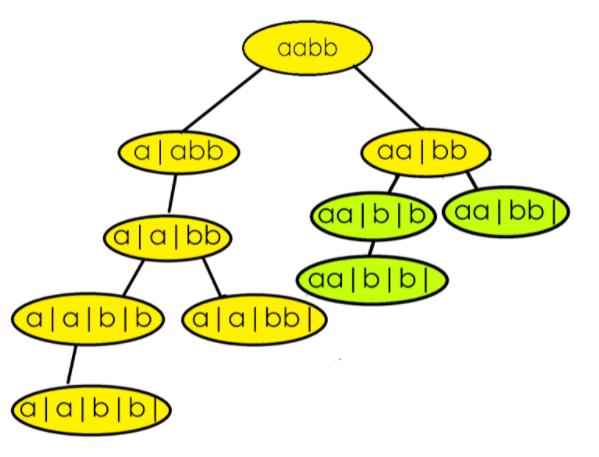

# [78. Subsets](https://leetcode.com/problems/subsets/description/)

## Approach ->
- The code generates all possible subsets of a given array by using a recursive approach. For each element in the array, it explores two options: including the element in the current subset or excluding it. The process continues recursively until all elements are considered, and the subsets are stored in the ans vector.

In the interview make the recursive tree, that will help you come up with the approach, and vizualise space complexity.


TC-> O(2^N) * O(N). 
Every elements have 2 options, and we have N elements, hence O(2^N) times the recursive calls. And each subset can take up to 
O(N) time to be copied into the result list.
SC-> O(2N)
The maximum height of the recursive tree will be N, so the stack space occupied is O(N). But we are also storing the subsets in our ans, so additional O(N) auxilary space. 

---
## Code ->
```cpp
class Solution {
public:
    vector<vector<int>> ans;

    void subsets(vector<int>& nums, vector<int> temp, int n){
        if(n<0){ // if n is negative, push temp in ans
            ans.push_back(temp);
            return;
        }
        
        // Include the current element in the subset
        temp.push_back(nums[n]);
        subsets(nums, temp, n-1); // trust recursion and let it explore more options

        // Exclude the current element from the subset
        temp.pop_back();
        subsets(nums, temp, n-1); // let recursion explore
    }

    vector<vector<int>> subsets(vector<int>& nums) {
        vector<int> temp;
        int n = nums.size();

        subsets(nums, temp, n-1);
        return ans;
    }
};
```

After this, the interviewer might ask "what if we have duplicate elements"?

# [62. Unique Paths](https://leetcode.com/problems/unique-paths/)

## Approach -> 
If we reach the end (m-1 && n-1 index) then return 1. If we go out of bounds then return 0. These two are the base conditions. Now what result we have got from the left transition and the right transition will sum it up and return the answer.

Note: Recursive sol will give TLE.

---
## Code ->
```cpp
class Solution {
public:
    int helper(int m, int n, int i=0, int j=0){
        if(i==m-1 && j==n-1) return 1;
        if(i>=m || j>=n) return 0;

        return helper(m, n, i+1, j) + helper(m, n, i, j+1);
    }
    int uniquePaths(int m, int n) {
        return helper(m, n);
    }
};
```
### Complexity Analysis
At each cell (i, j), two recursive calls are made. 
TC -> O(2^(m+n)) ---- Exponential.
The space used is due to the recursive call stack. The maximum depth of recursion is m+n
SC -> O(m+n)

### DP Solution:
```cpp
class Solution {
public:
    int helper(int m, int n, vector<vector<int>> &dp){
        if(m==0 && n==0){
            return 1;
        }
        if(m<0 || n<0){
            return 0;
        }

        if(dp[m][n] != -1) return dp[m][n]; // If the dp has the ans, simply return it.

        return dp[m][n] = helper(m-1, n, dp) + helper(m, n-1, dp); // store the ans in dp.
 
    int uniquePaths(int m, int n) {
        vector<vector<int>> dp(m, vector<int>(n, -1)); // Take dp of size m and n and populate them with -1
        return helper(m-1, n-1, dp);
    }
};
```
### Complexity Analysis
TC-> Since the code visits every possible position of m and n once, therefore the TC is O(m*n)
SC-> SC of DP is O(m * n) and SC of recursive call stack is O(m+n) hence the overall SC is O(m*n)


# [ Subset Sum Equal To K](https://www.codingninjas.com/studio/problems/subset-sum-equal-to-k_1550954?leftPanelTabValue=PROBLEM)

## Approach ->
- Same as of last problem, just we need to keep a track of the sum instead of storing the subsets. Although this will throw TLE as this needs more optimization using DP, but we will see that later. 

## Code ->
- Parameterised recursion call
```cpp
#include <bits/stdc++.h> 
bool ans=false;
void helper(int n, int k, vector<int> &arr, int sum){
    if(n<0){
        if(sum==k) ans = true;
        return;
    }
    sum+=arr[n];
    helper(n-1, k, arr, sum);

    sum-=arr[n];
    helper(n-1, k, arr, sum);
}
bool subsetSumToK(int n, int k, vector<int> &arr) {
    // Write your code here.
    ans = false;
    helper(n-1, k, arr, 0);
    return ans;
}
```

- Functional recursion call
```cpp
#include <bits/stdc++.h> 
bool helper(int n, int k, vector<int> &arr, int i, int sum){
    if(i>=n){
        return sum==k?true:false;
    }

    sum+=arr[i];
    bool call1 = helper(n, k, arr, i+1, sum);

    sum-=arr[i];
    bool call2 = helper(n, k, arr, i+1, sum);

    return call1 || call2;
}
bool subsetSumToK(int n, int k, vector<int> &arr) {
    return helper(n, k, arr, 0, 0);
}
```

We can make the above code even shorter:
```cpp
bool helper(int n, int k, vector<int> &arr, int sum){
    if(sum==k) return true;
    if(n<0) return false;
    return (helper(n-1, k, arr, sum+arr[n]) || helper(n-1, k, arr, sum));   
}
bool subsetSumToK(int n, int k, vector<int> &arr) {
    return helper(n-1, k, arr, 0);
}
```

- The parameterised recursion will keep on executing till the very last recursive call but the functional one will stop making any further recursive calls as soon as the true condition is met.

# Merge Sort

## Approach ->
- Merge Sort is a divide and conquers algorithm, it divides the given array into equal parts and then merges the 2 sorted parts. 
- There are 2 main functions :
-  merge(): This function is used to merge the 2 halves of the array. It assumes that both parts of the array are sorted and merges both of them.
-  mergeSort(): This function divides the array into 2 parts. low to mid and mid+1 to high where,

```
low = leftmost index of the array

high = rightmost index of the array

mid = Middle index of the array 
```

We recursively split the array, and go from top-down until all sub-arrays size becomes 1.

---
## Code ->
```cpp
#include <bits/stdc++.h>
using namespace std;

void merge(vector<int> &arr, int low, int mid, int high) {
    vector<int> temp; // temporary array
    int left = low;      // starting index of left half of arr
    int right = mid + 1;   // starting index of right half of arr

    //storing elements in the temporary array in a sorted manner//

    while (left <= mid && right <= high) {
        if (arr[left] <= arr[right]) {
            temp.push_back(arr[left]);
            left++;
        }
        else {
            temp.push_back(arr[right]);
            right++;
        }
    }

    // if elements on the left half are still left //

    while (left <= mid) {
        temp.push_back(arr[left]);
        left++;
    }

    //  if elements on the right half are still left //
    while (right <= high) {
        temp.push_back(arr[right]);
        right++;
    }

    // transfering all elements from temporary to arr //
    for (int i = low; i <= high; i++) {
        arr[i] = temp[i - low];
    }
    // instead of using i-low we could have created another variable x=0 and could have done temp[x++]
}

void mergeSort(vector<int> &arr, int low, int high) {
    if (low >= high) return;
    int mid = (low + high) / 2 ;
    mergeSort(arr, low, mid);  // left half
    mergeSort(arr, mid + 1, high); // right half
    merge(arr, low, mid, high);  // merging sorted halves
}

int main() {

    vector<int> arr = {9, 4, 7, 6, 3, 1, 5}  ;
    int n = 7;

    cout << "Before Sorting Array: " << endl;
    for (int i = 0; i < n; i++) {
        cout << arr[i] << " "  ;
    }
    cout << endl;
    mergeSort(arr, 0, n - 1);
    cout << "After Sorting Array: " << endl;
    for (int i = 0; i < n; i++) {
        cout << arr[i] << " "  ;
    }
    cout << endl;
    return 0 ;
}
```
Time complexity: O(nlogn) 

Reason: At each step, we divide the whole array into two halves, for that logn and we assume n steps are taken to get sorted array, so overall time complexity will be nlogn

Space complexity: O(n)  

Reason: We are using a temporary array to store elements in sorted order.

# Quick Sort

## Approach/Intuition ->
Quick Sort is a divide-and-conquer algorithm like the Merge Sort. But unlike Merge sort, this algorithm does not use any extra array for sorting(though it uses an auxiliary stack space). So, from that perspective, Quick sort is slightly better than Merge sort.

This algorithm is basically a repetition of two simple steps that are the following:

Pick a pivot and place it in its correct place in the sorted array.
Shift smaller elements(i.e. Smaller than the pivot) on the left of the pivot and larger ones to the right.
Now, let’s discuss the steps in detail considering the array {4,6,2,5,7,9,1,3}:

Step 1: The first thing is to choose the pivot. A pivot is basically a chosen element of the given array. The element or the pivot can be chosen by our choice. So, in an array a pivot can be any of the following:

The first element of the array
The last element of the array
Median of array
Any Random element of the array
After choosing the pivot(i.e. the element), we should place it in its correct position(i.e. The place it should be after the array gets sorted) in the array. For example, if the given array is {4,6,2,5,7,9,1,3}, the correct position of 4 will be the 4th position.

Note: Here in this tutorial, we have chosen the first element as our pivot. You can choose any element as per your choice.

Step 2: In step 2, we will shift the smaller elements(i.e. Smaller than the pivot) to the left of the pivot and the larger ones to the right of the pivot. In the example, if the chosen pivot is 4, after performing step 2 the array will look like: {3, 2, 1, 4, 6, 5, 7, 9}. 

From the explanation, we can see that after completing the steps, pivot 4 is in its correct position with the left and right subarray unsorted. Now we will apply these two steps on the left subarray and the right subarray recursively. And we will continue this process until the size of the unsorted part becomes 1(as an array with a single element is always sorted).

So, from the above intuition, we can get a clear idea that we are going to use recursion in this algorithm.

To summarize, the main intention of this process is to place the pivot, after each recursion call, at its final position, where the pivot should be in the final sorted array.

## Code ->
```cpp
#include <bits/stdc++.h>
using namespace std;

// Function to partition the array and return the pivot index
int partition(vector<int> &arr, int low, int high) {
    // Choose the first element as the pivot
    int pivot = arr[low];
    int i = low;
    int j = high;

    // Move elements smaller than the pivot to the left and larger to the right
    while (i < j) {
        while (arr[i] <= pivot && i <= high - 1) {
            i++;
        }

        while (arr[j] > pivot && j >= low + 1) {
            j--;
        }

        // Swap arr[i] and arr[j] if they are out of order
        if (i < j) swap(arr[i], arr[j]);
    }

    // Swap the pivot element to its correct position
    swap(arr[low], arr[j]);

    // Return the index of the pivot element
    return j;
}

// Quicksort recursive function
void qs(vector<int> &arr, int low, int high) {
    // Base case: if the partition size is greater than 1
    if (low < high) {
        // Find the pivot index such that elements on the left are smaller and on the right are larger
        int pIndex = partition(arr, low, high);

        // Recursively sort the subarrays on the left and right of the pivot
        qs(arr, low, pIndex - 1);
        qs(arr, pIndex + 1, high);
    }
}

// Wrapper function for quicksort
vector<int> quickSort(vector<int> arr) {
    // Call the quicksort function with the entire array
    qs(arr, 0, arr.size() - 1);

    // Return the sorted array
    return arr;
}

int main() {
    // Sample array for testing
    vector<int> arr = {4, 6, 2, 5, 7, 9, 1, 3};
    int n = arr.size();

    // Display the array before using quicksort
    cout << "Before Using Quick Sort: " << endl;
    for (int i = 0; i < n; i++) {
        cout << arr[i] << " ";
    }
    cout << endl;

    // Call the quicksort function and display the sorted array
    arr = quickSort(arr);
    cout << "After Using Quick Sort: " << "\n";
    for (int i = 0; i < n; i++) {
        cout << arr[i] << " ";
    }
    cout << "\n";

    return 0;
}
```
- Time Complexity: O(N*logN), where N = size of the array.
- Space Complexity: O(1) + O(N) auxiliary stack space.

# Implement string to integer

## Code ->
```cpp
class Solution {
public:
    int helper(string s, int n){
        if (n == 0) 
            return s[n] - '0';

        // Recursive case: combine previous value with current digit
        int preNums = helper(s, n - 1);
        int curNum = s[n] - '0';

        // Combine values by multiplying the previous value by 10 and adding the current value
        return preNums * 10 + curNum;
    }
    int myAtoi(string s) {
        return helper(s, s.size()-1);
    }
};
```

# [50. Pow(x, n)](https://leetcode.com/problems/powx-n/description/)

## Approach ->
The recursive approach leverages the observation that exponentiation problems, such as x^n, can be optimized by breaking them down into subproblems. By dividing the exponent (n) into halves, the recursive function efficiently calculates the result, taking advantage of the fact that we can write x^8 as (x^4 * x^4) and we can write x^9 as (x^4 * x^4 * x) This approach reduces the time complexity to logarithmic (log n) by repeatedly halving the exponent.

Think of an edge case now.. Did you think of any? 
Ask the interviewer about the edge case - can x and n be negative? The interviewer will say that yes it will be, so to tackle that you make the normal recursive calls but while finally returning the ans check if n is negative, if yes then return 1/ans else simply return ans. And for x you don't have to worry because while solving - values for x are tackled automatically (because 2*2*2 is 8 but -2*-2*-2 is -8 and it gets tackled automatically)
## Code ->
```cpp
#include <cmath>

class Solution {
public:
    double helper(double x, int n) {
        // Base case: if x is 0, result is 0
        if (x == 0) return 0;
        // Base case: if n is 0, result is 1
        if (n == 0) return 1;

        // Recursive calculation for half of the exponent
        double res = helper(x, n / 2);
        // Square the result obtained from the recursive call
        res = res * res;

        // Adjust result for even exponent
        if (n % 2 == 0) return res;
        // Multiply the result by x for odd exponent
        else return res * x;
    }

    // Main function to calculate power with handling for negative exponent
    double myPow(double x, int n) {
        // Call the helper function to calculate power
        double ans = helper(x, n);

        // Adjust the result for negative exponent
        if (n < 0) return 1 / ans;
        else return ans;
    }
};
```

TC -> Each recursive call reduces the problem size by half: helper(x, n/2). Therefore, the number of recursive calls is log[n]. So TC is O(log(n)).

SC -> The space complexity depends on the recursion depth: At each step, a new stack frame is added to the call stack.
The maximum recursion depth is also O(log∣n∣).
So: Space Complexity = O(log(n)) (due to recursion stack).

# [1922. Count Good Numbers](https://leetcode.com/problems/count-good-numbers/description/)

## Approach -> 
It is a simple PNC question where we mod everything and make everything long long as much as possible to avoid wrong answers due to overflow. Please remember to make everything long long as much as possible during the interview. We know that the even places will have 5 possible numbers(0,2,4,6,8) and odd places will have 4 possible numbers(1,3,5,7). So we will simply return 5^even * 4^odd as our answer and find the power using recursion because we need to mod everything inside power function.

## Code -> 
```cpp
class Solution {
public:
    int MOD = 1000000007;
    int power(long long int n, long long int m){
        if(n==0) return 0;
        if(m==0) return 1;

        long long int res = power(n, m/2);
        res = (res*res)%MOD;
        if(m%2==0) return (res);
        else return (res*n)%MOD;
    }
    int countGoodNumbers(long long n) {
        long long int odd = n/2;
        long long int even = (n+1)/2; 
        // Don't use ceil(n/2) instead of (n+1)/2 above, because both n and 2 are integers, n/2 performs integer division, which truncates (discards) the decimal part. Instead you can use ceil(n/2.0);

        long long int first = power(5, even);
        long long int second = power(4, odd);

        return int((first*second)%MOD);
    }
};
```

TC-> Called twice for (5^even) and (4^odd) → Total time = O ( log ⁡even + log ⁡odd ) = O(log n).
SC-> O(log n)

# [39. Combination Sum](https://leetcode.com/problems/combination-sum/)

## [Approach](https://takeuforward.org/data-structure/combination-sum-1/)

## Code ->
```cpp
class Solution {
public:
    void helper(vector<int> &candidates, int target, vector<vector<int>> &ans, vector<int> temp, int i){
        if(target<0) return; // To terminate the cases where i is not increasing
        if(i>=candidates.size()){ // Will terminate the cases where i is increasing
            if(target==0) ans.push_back(temp); // If we have reached the end, and achieved target then include in ans
            return;
        }

        temp.push_back(candidates[i]);
        target-=candidates[i];
        helper(candidates, target, ans, temp, i);

        temp.pop_back();
        target+=candidates[i];
        helper(candidates, target, ans, temp, i+1);
    }
    vector<vector<int>> combinationSum(vector<int>& candidates, int target) {
        vector<vector<int>> ans;
        vector<int> temp;
        helper(candidates, target, ans, temp, 0);
        return ans;
    }
};
```
Time Complexity: O(2^t * k) where t is the target, k is the average length of each combination

Reason: 
Case 1: Assume if you were not allowed to pick a single element multiple times, every element will have a couple of options: pick or not pick which is 2^n different recursion calls, also assuming that the average length of every combination generated is k. So total TC-> O(2^n * k) (expl: to put temp of length (let's say k) in ans, it will take a TC of O(k), because that is not a O(1) operation.)

Case 2: In this question where picking a single element multiple times is allowed, why is the TC not (2^n) but (2^t) (where n is the size of an array, and t is the target )?

Assume that you are given [1] as candidates and the target is given as 10, so 10 times you can “pick or not pick” a single element that is given. So for each element given as a candidate, you can pick it 'target' number of times in the worst case scenerio. Hence the overall TC-> O(2^t * k)

Space Complexity: Recrusive stack can go as long as target so O(t) for that and for the vector ans it is O(k*x), k is the average length and x is the no. of combinations (basically the total size of the ans vector)

# [40. Combination Sum II](https://leetcode.com/problems/combination-sum-ii/description/)

# Intuition:
- The problem involves finding all unique combinations of candidates that sum to the target.
- Unlike the last problem, Combination Sum, we cannot use an element multiple times.
- The key challenge is to avoid duplicate combinations in the result because the elements given are not unique, they might be repeating.
- Another thing that's not mentioned in the question but should be is - our ans can be in lexicographically sorted order, it doesn't matter.
- A recursive backtracking approach is used to explore and generate combinations.

- The brute force approach that comes in my mind is that we just copy the code for combination sum 1 and on the step where we are including the element and not moving the index, we move the index. Also instead of passing the vector of vector ans, we pass a hashset so that there is no duplicates. But that's only going to increase the space complexity of the problem. And the TC will increase to (2^t) * k log n, because inserting an elemnt into a set has a TC of O(log n), so that will be extra as well.

- We cannot afford this brute force algo, so we have to modify our recursion in a different way. So instead of the pick-not pick method, we will go with pick subsequences method. This way we can ignore the duplicate answers. How? Let's look at the recursive tree to understand that.


Here, we are calling f(index, target, ans). In the first iteration when our index is at 0, we take the first 1 and then ignore the next two 1s. Then we take the 2 and ignore the next 2. In the second iteration, the index has moved to position 1, so we take that 1 and ignore the next 1. Then we take the 2 and ignore the next 2. That way we have now a combination of [1,1,2], which is equal to target(the first 1 is from the last recursive call where we had picked the 1 at index 0).
This way we will never get a duplicate answer because for every index we have a unique answer (because we ignore the duplicates on every index).

# Approach:
- Sort the Candidates: Before starting the recursive calls, sort the candidates. Sorting is crucial to avoid duplicate combinations and to make the combinations appear in a sorted order.

- Define Recursive Helper Function.

- Base Cases: If the current sum exceeds the target, return. If the current sum equals the target, add the current combination to the ans and return.

- Loop Through Candidates: Use a loop starting from the current index (idx) to the end of the candidates array. Skip consecutive duplicates to avoid duplicate combinations. If the current candidate is greater than the remaining target, break the loop (optimization). Include the current candidate in the temp combination. Recursively call the helper function with updated parameters. Remove the last added element to backtrack and explore other combinations.

- Recursive Calls: The recursive calls explore combinations with the current element included (temp.push_back) and without it (temp.pop_back).


Extra Note: In this question we are required to ignore duplicates and return the answer in sorted order.
So an approach might come in your head that why not keep the code same as of the last question and just increase the index even when we pick the element. Well that would have worked if there was no condition saying "find all unique combinations in candidates where the candidate numbers sum to target". But since we also have to keep the ans with unique elements only we will have to apply a different method of doing so.

Here's an example of understanding what is the wrong output and what is the right output:

Wrong output: [[1,2,5],[1,7],[1,6,1],[2,6],[2,1,5],[7,1]]
Right output: [[1,2,5],[1,7],[1,6,1],[2,6]]

---
## Code ->
```cpp
class Solution {
public:
    void helper(vector<int>& candidates, int target, int idx, vector<int> temp, vector<vector<int>> &ans){
        // In base case first check if target is 0 then push in ans.
        // if you do the mistake of checking - if target is negative then return without ans, then that will give wrong ans bc the recursion stops without checking if a valid combination exists later.
        if (target == 0) {
            ans.push_back(temp);
            return;
        }
        if (idx >= candidates.size()) {
            return;
        }

        for(int i = idx; i<candidates.size(); i++){
            // Most important condition: Here we include the first element, instead of the last.
            // So instead of checking for candidates[i]==candidates[i+1] and take the last repeating element, we take the first
            // i>idx helps us ignore the first repeating element and avoid runtime error.
            // in case of [1,1,1,2,2] if we are at the index 0, it will avoid runtime error.
            // if we are at index 1 for second iteration, and if we don't have this condition then index 1's 1 will never be picked.
            if(i>idx && candidates[i]==candidates[i-1]) continue;
            if(candidates[i]>target) return; // optimization

            temp.push_back(candidates[i]);

            helper(candidates, target-candidates[i], i+1, temp, ans);

            temp.pop_back();
        }
    }
    vector<vector<int>> combinationSum2(vector<int>& candidates, int target) {
        vector<vector<int>> ans;
        vector<int> temp;

        sort(candidates.begin(), candidates.end());

        helper(candidates, target, 0, temp, ans);
        return ans;
    }
};
```

The condition if(i > idx && candidates[i] == candidates[i-1]) continue; takes care of skipping over duplicate elements at the current level of recursion. In other words, when you encounter a duplicate, you skip the recursive call for that duplicate element, ensuring that you don't generate duplicate combinations.

# Time Complexity:O(2^n*k)

Reason: Assume if all the elements in the array are unique then the no. of subsequence you will get will be O(2^n). we also add the ds to our ans when we reach the base case that will take “k”//average space for the ds.

# Space Complexity:O(k*x)

Reason: if we have x combinations then space will be x*k where k is the average length of the combination.

# [Subset Sum](https://www.codingninjas.com/studio/problems/subset-sum_3843086?utm_source=striver&utm_medium=website&utm_campaign=a_zcoursetuf&leftPanelTabValue=PROBLEM)

## Approach -> 
Easy peasy using pick-not pick method. Note: Don't sort the num array, instead sort the ans vector after populating the answer.

## Code ->
```cpp
void helper(vector<int> num, int sum, int idx, vector<int> &ans){
	if(idx==num.size()){
		ans.push_back(sum);
		return;
	}
	helper(num, sum+num[idx], idx+1, ans);
	helper(num, sum, idx+1, ans);
}
vector<int> subsetSum(vector<int> &num){
	// Write your code here.	
	vector<int> ans;
	helper(num, 0, 0, ans);
	sort(ans.begin(), ans.end());
	return ans;
}
```

Time Complexity: O(2^n)+O(2^n log(2^n)). Each index has two ways. You can either pick it up or not pick it. So for n index time complexity for O(2^n) and for sorting it will take (2^n log(2^n)).

Space Complexity: O(2^n) for storing subset sums, since 2^n subsets can be generated for an array of size n. And O(n) for the recursive stack, but that is negligible. So overall SC-> O(2^n).

# [90. Subsets II](https://leetcode.com/problems/subsets-ii/description/)

## Approach ->
Lets  understand  with an example where arr = [1,2,2 ]. In the interview draw the recursive tree for this to understand. Since this is the question of avoiding the duplicates, so we will not apply pick-not pick, we will apply our pick subsequences method.

Let's look at the recursive tree diagram to understand.


Note here that all the generated elements here is a unique subset, hence there is no base condition in this solution. We can simply push the temp to our answer after every recursion call.

Let’s summarize:-

Sort the input array. Make a recursive function that takes the input array, the current subset/temp, the current index and a vector of vectors to contain the answer.
Run a loop from 0 to n-1 and only pick up elements that are appearing for the first time during a recursion call to avoid duplicates and call recursion for all of them.
While returning/backtracking, remove the last element that was inserted.

## Code -> 
```cpp
class Solution {
public:
    void helper(vector<int> nums, int idx, vector<int>temp, vector<vector<int>>& ans){
        // No explicit base condition because we want to generate subsets for all indices.
        ans.push_back(temp);

        for(int i=idx; i<nums.size(); i++){
            if(i>idx && nums[i]==nums[i-1]) continue;
            temp.push_back(nums[i]);
            helper(nums, i+1, temp, ans); // call for i+1, and not idx+1
            temp.pop_back();
        }
    }
    vector<vector<int>> subsetsWithDup(vector<int>& nums) {
        sort(nums.begin(), nums.end()); // very important to sort since we are ignoring duplicate at a given position
        vector<int> temp;
        vector<vector<int>> ans;
        helper(nums, 0, temp, ans);
        return ans;
    }
};
```
Time Complexity: O(2^n) for generating every subset and O(k)  to insert every subset in another data structure if the average length of every subset is k. Overall O(k * 2^n).

Space Complexity: O(2^n * k) to store every subset of average length k. Auxiliary space is O(n)  if n is the depth of the recursion tree.


# [46. Permutations](https://leetcode.com/problems/permutations/description/)

## Approaches ->
1. BRUTE FORCE- Frequency array approach -> (You can skip this if you want and jump to the optimal solution)
- Create a frequency vector freq to keep track of whether an element has been used in the current permutation.

- If the size of the temporary vector temp becomes equal to the size of the input array nums, it means a valid permutation is found. Add it to the result vector ans.

- Iterate through each element in the nums array.
- If the element has not been used (frequency is 0), add it to the temporary vector temp.
- Mark the element as used by updating its frequency in the freq vector to 1.
- Recursively call the helper function with the updated temp and freq.
- After the recursive call, backtrack by marking the element as unused and removing it from temp.

Time Complexity:

The time complexity of the provided approach is O(N!), where N is the number of distinct integers in the input array nums. This is because, in each recursive call, the algorithm explores all possible choices for the next element, and there are N elements in the array. The recursive function is called N times for the first element, (N-1) times for the second element, (N-2) times for the third element, and so on, resulting in a total of N * (N-1) * (N-2) * ... * 1 = N! recursive calls.

Space Complexity:

The space complexity is O(N) for the recursion stack and O(N) for the temporary vectors used in each recursive call. The recursion stack depth is at most N, as the algorithm explores each element in the array. Additionally, each recursive call creates a temporary vector temp of size N. Therefore, the overall space complexity is O(N + N) = O(N).

## Code ->
```cpp
class Solution {
public:
    void helper(vector<int> nums, vector<int> temp, vector<vector<int>> &ans, vector<int> freq){
        if(temp.size()==nums.size()){
            ans.push_back(temp);
            return;
        }

        for(int i=0; i<nums.size(); i++){
            if(!freq[i]){
                temp.push_back(nums[i]);
                freq[i]=1;
                helper(nums, temp, ans, freq);
                freq[i]=0;
                temp.pop_back();
            }
        }
    }
    vector<vector<int>> permute(vector<int>& nums) {
        vector<int> temp;
        vector<vector<int>> ans;
        vector<int> freq(nums.size(),0);
        helper(nums, temp, ans, freq);
        return ans;
    }
};
```

2. OPTIMAL- Swapping to generate all permutations Approach ->


## Intuition->

The idea is to generate all permutations of a given list of numbers using a recursive swapping approach. Instead of creating new arrays or using visited flags, we use in-place swaps to explore all possible arrangements efficiently.
At each recursion level, we fix one element at the current index (idx) and recursively find permutations of the rest of the array.
This is done by swapping the element at index i with the element at index idx where i ranges from idx to the end of the array.
After recursive calls, we backtrack by undoing the swap, thus restoring the array to its original form before the next iteration.
This method avoids using extra space for temporary vectors and ensures that each recursive call works on a modified version of the array via swaps. Look at the recursive tree and see how in the first step we have fixed 1 and then run a loop from 1 to 3 (index 0-2) and swapped 1 with each of them. Look at the code now to understand the steps. 


## Code ->
```cpp
class Solution {
public:
    // Helper function to generate permutations
    void helper(vector<int> nums, vector<vector<int>> &ans, int idx){
        // Base case: If index reaches end, we have a complete permutation
        if(idx == nums.size()){
            ans.push_back(nums); 
            return;
        }

        // Iterate over the array from current index to end
        for(int i = idx; i < nums.size(); i++){
            swap(nums[idx], nums[i]);      // Swap the elem at fixed idx with all the upcoming elements.
            helper(nums, ans, idx + 1);    // Recurse for the next index, note: call for idx+1 and not i
            swap(nums[idx], nums[i]);      // Backtrack to restore original array
        }
    }

    // Main function to be called
    vector<vector<int>> permute(vector<int>& nums) {
        vector<vector<int>> ans;
        helper(nums, ans, 0);
        return ans;
    }
};

```
## TIme and Space Complexity
The time complexity is O(N! * N), where N is the number of distinct integers in the input array nums. reason - Because there are N! permutations, and there is one additional loop running from i to n-1. 

The space complexity is O(N) for the recursion stack, as the recursion explores each element in the array. The space complexity is optimized compared to the previous approach as it doesn't use additional temporary vectors in each recursive call.

# [22. Generate Parentheses](https://leetcode.com/problems/generate-parentheses/description/)
## Approach ->
The helper function is called recursively with three parameters: the remaining counts of open parentheses (open), close parentheses (close), and the current combination string (str). The base case is when both open and close counts are zero, at which point the current combination is added to the result vector (ans).

The recursion explores two possibilities at each step:

If there are remaining open parentheses (open > 0), it appends an open parenthesis to the current combination and calls the helper function with reduced open count.
If there are remaining close parentheses (close > 0 and there are more open parentheses than closed ones), it appends a close parenthesis to the current combination and calls the helper function with reduced close count.

## Code ->
```cpp
class Solution {
public:
    void helper(int n, int open, int close, vector<string> &ans, string str){
        if(open==0 && close==0){
            ans.push_back(str);
            return;
        }
        if(open){
            helper(n, open-1, close, ans, str+'(');
        } 
        
        if(close && open<close){
            helper(n, open, close-1, ans, str+')');
        }
    }
    vector<string> generateParenthesis(int n) {
        vector<string> ans;
        helper(n, n, n, ans, "");
        return ans;
    }
};
```
# [51. N-Queens](https://leetcode.com/problems/n-queens/description/)
### Approach 1 ->
The N-Queens problem requires placing N queens on an N x N chessboard such that no two queens attack each other. Queens can attack horizontally, vertically, or diagonally. The goal is to find all possible valid configurations.
---

Intuition: 
Place Queens Column by Column:
Start from the first column and try placing a queen in each row of that column. For each placement, check if it's valid (no conflicts with previously placed queens). Since we are placing the queens column by column, hence we need not check on the right side of the board or the same column for another queen, we just have to check the left side i.e. Left, Upper-Left, Lower-Left.

Validation Checks:
- Left Side: Ensure no queen is present in the same row to the left.
- Upper Diagonal: Ensure no queen is in the upper-left diagonal.
- Lower Diagonal: Ensure no queen is in the lower-left diagonal.

Backtracking:
If a queen placement is valid, move to the next column. If no valid placement is found in a column, backtrack and try the next row in the previous column.


As you can see in this diagram, first we fix the column and iterate over each row and place a Q there (if it is valid to place a Q there). 
In the diagram we have fixed column 0 and iterated over each row of this column. Then we checked if Q can be place on the particular row, if yes then we placed the Q on that row and called the recursion for the next column and when we come back we remove the Q to explore other possibilites. 
In the above diagram all the cases for placing the Q in board[0][0] failed.


In the above diagram when we placed the first queen at board[0][1], and then called the recursion for the next columns, then one of the possibilities was able to place n queens on the n*n chess board. When that happens we know that our column has moved outside of the box i.e. at index n. So that's when we can populate our answer. 


## Codes ->
Code 1
```cpp
class Solution {
public:
    bool isValid(int row, int col, int n, vector<string>board){
        // checking left
        int r = row;
        int c = col;
        while(c>=0){
            if(board[r][c--]=='Q') return false;
        }

        // checking down-left diagonal
        r = row;  
        c = col;
        while(r<n && c>=0){
            if(board[r++][c--]=='Q') return false;
        }
        
        // checking up-left diagonal
        r = row;
        c = col;
        while(r>=0 && c>=0){
            if(board[r--][c--]=='Q') return false;
        }
        return true;
    }
    void helper(int col, vector<string> board, vector<vector<string>> &ans, int n){
        // Base case: All queens placed successfully
        if(col == n){
            ans.push_back(board);
            return;
        }

        // Try placing queen in each row of the current column if the position is valid
        for(int row=0; row<n; row++){
            if(isValid(row, col, n, board)){
                board[row][col]='Q'; // Place Q
                helper(col+1, board, ans, n); // Recursion call for next column
                board[row][col]='.'; // Remove Q
            }
        }
    }
    vector<vector<string>> solveNQueens(int n) {
        vector<vector<string>> ans;
        vector<string> board(n); // Initialize a board of size n
        string s (n, '.'); // The board will have the string of size n on every position
        for(int i=0; i<n; i++) board[i]=s;
        helper(0, board, ans, n);
        return ans;
    }
};
```
### Time and space complexity->
Time Complexity: O(N! * N)
Reason:
- Branching Factor: For the first column, there are N choices, for the next column at most N-1, and so on. Total there are N columns. This leads to roughly N! configurations.
- Validation: For each configuration, we perform O(N) checks (worst-case) to validate queen placement.
Total: O(N! * N).

Space Complexity: O(N²)
Reason:
- The chessboard (board) is N x N.
- Recursion depth is N (one level per column). But it is negligible infront of N*N so we can ignore it.

### Approach 2 (Optimized)->
We ask ourselves — "Can we reduce the time it takes to check whether placing a queen is valid?"
Instead of scanning the board again and again in isValid function, what if we store whether a row or diagonal that already has a queen using separate arrays?
This way, we can check if a position is valid in just O(1) time.

Let's observe something here..

NOTE: (just see the diagram here, the things written in the diagram itself if false, just focus on the explanation from my notes and the diagram from the picture)
This is the diagram for checking in the left and lower diagonal. For checking in the left, just make a 1D array of size n, and simply mark left[row] = 1 when a queen is placed — then we can directly check if a queen already exists in that row.

For the lower diagonal, make a 1D array of size 2n - 1. This represents all possible (row + col) values on an n x n board, since row + col ranges from 0 to 2n - 2. As you can observe in the diagram, for every diagonal in the lower left, if we add the row and column, the value remains the same — so we can utilize that index in the array to check if a queen exists on that diagonal.


This is the diagram for checking in the top left diagonal. This follows the formula (n-1)+(col-row) for each position in the diagonal.

In Approach 1, we manually looped through each direction (left, upper-left diagonal, and lower-left diagonal) to check for the presence of a queen. However, this costs O(N) time per validation, which becomes expensive as N grows.

In Approach 2, using these pre-computed arrays for:
- left[row]
- lowerDiagonal[row + col]
- upperDiagonal[n - 1 + col - row]
we reduce the validation step to just O(1) time per position.

So now the only costly operation is exploring all valid board configurations (which is unavoidable since the number of solutions is exponential). But each queen placement is now much faster.

```cpp
class Solution {
public:
    void helper(int col, vector<string> &board, vector<vector<string>> &ans, int n, vector<int> &leftrow, vector<int> &upperDiagonal, vector<int> &lowerDiagonal){
        if(col == n){
            ans.push_back(board);
            return;
        }

        // Try placing a queen in every row of the current column
        for(int row=0; row<n; row++){
            // Check if the current row and diagonals are free to place a queen
            if(leftrow[row]==0 && upperDiagonal[n-1+col-row]==0 && lowerDiagonal[row+col]==0){
                // Place the queen
                board[row][col]='Q';
                // Mark the row and diagonals as occupied
                leftrow[row]=1;
                upperDiagonal[n-1+col-row]=1;
                lowerDiagonal[row+col]=1;

                // Recurse for the next column
                helper(col+1, board, ans, n, leftrow, upperDiagonal, lowerDiagonal);

                // Backtrack: remove the queen and unmark the positions
                board[row][col]='.'; 
                leftrow[row]=0;
                upperDiagonal[n-1+col-row]=0;
                lowerDiagonal[row+col]=0;
            }
        }
    }
    vector<vector<string>> solveNQueens(int n) {
        vector<vector<string>> ans;
        vector<string> board(n);
        string s (n, '.');
        for(int i=0; i<n; i++) board[i]=s;

        vector<int>leftrow(n, 0); // // Tracks rows with queens
        vector<int> upperDiagonal(2*n-1, 0); // Tracks upper-left diagonals
        vector<int> lowerDiagonal(2*n-1, 0); // Track bottom-left diagonals
        helper(0, board, ans, n, leftrow, upperDiagonal, lowerDiagonal);
        return ans;
    }
};
```
### Time and space complexity:
Time Complexity: O(N!)
Space Complexity: O(N²)

# [131. Palindrome Partitioning](https://leetcode.com/problems/palindrome-partitioning/)

## Intuition->
We need to partition a string such that every substring in the partition is a palindrome. Return all possible palindrome partitions.

Example: For "aab", valid partitions are ["a","a","b"] and ["aa","b"].

Intuitive Approach:
- Backtracking: We'll explore all possible partitions using backtracking.
- Palindrome Check: At each step, we check if the current substring is a palindrome.
- Recursive Exploration: If it is a palindrome, we add it to our current path temp and recursively explore partitions for the remaining string.

What exactly to do:
- We fix a starting index that represents where our current partition begins.
- Then we run a loop using i from that fixed index to the end of string. For each possible position of i (from index to end of string):
    - Check if substring s[index to i] is a palindrome
    - If yes, add it to current partition temp and recursively process the remaining string with our new index as i+1.
- Backtrack by removing the last added substring to explore other possibilities

Let us look at this recursive tree and try to dry run it to understand..


### 🔍 Input: `"aab"`

We want to find all ways to split this string such that every substring in a split is a **palindrome**.

---

### 📌 Step-by-step Dry Run (Using Backtracking Tree in Image):

---

####  Level 0

* Start at index `0` (`idx = 0`)
* Try all substrings starting from idx to i:

  * `"a"` (from 0 to 0) → ✅ Palindrome

    * `curr = ["a"]` → Go deeper
  * `"aa"` (from 0 to 1) → ✅ Palindrome

    * `curr = ["aa"]` → Go deeper
  * `"aab"` (from 0 to 2) → ❌ Not a palindrome → Pruned

---

####  Level 1: Left branch from `"a"`

* Now `idx = 1` (after adding first `"a"`)
* Try:

  * `"a"` (from 1 to 1) → ✅ Palindrome

    * `curr = ["a", "a"]` → Go deeper

---

####  Level 2: Left branch from \["a", "a"]

* Now `idx = 2`
* Try:

  * `"b"` (from 2 to 2) → ✅ Palindrome

    * `curr = ["a", "a", "b"]` → ✅ End of string → Add to answer

🧾 First Valid Answer: `["a", "a", "b"]`

⬅️ Backtrack (pop `"b"` → `"a", "a"`)

⬅️ Backtrack again (pop second `"a"` → `"a"`)

---

####  Level 1: Right branch from `"aa"`

* Now `idx = 2`
* Try:

  * `"b"` (from 2 to 2) → ✅ Palindrome

    * `curr = ["aa", "b"]` → ✅ End → Add to answer

🧾 Second Valid Answer: `["aa", "b"]`

⬅️ Backtrack (pop `"b"` → `"aa"`)

⬅️ Backtrack again (pop `"aa"` → `[]`)

---

### Final Result:

All possible palindromic partitions of `"aab"` are:

```
[["a", "a", "b"], ["aa", "b"]]
```
Look at this recursive tree for another example.. Try to understand this -> 

---

## Code ->
```cpp
class Solution {
public:
    bool isPalindrome(int idx, int i, string s){
        while(idx<i){
            if(s[idx++] != s[i--]) return false;
        }
        return true;
    }
    void helper(string s, vector<vector<string>> &ans, vector<string> &temp, int idx){
        if(s.size()==idx){
            ans.push_back(temp);
            return;
        }

        // Fix the idx and go from idx to last character in the array
        for(int i=idx; i<s.size(); i++){
            if(isPalindrome(idx, i, s)){ // if the substring from idx to i is palindrome
                temp.push_back(s.substr(idx, i-idx+1)); // push substring idx to i in temp
                helper(s, ans, temp, i+1); // call recursion to find other partitions, with new idx as i+1
                temp.pop_back(); // reset temp
            }
        }
        
    }
    vector<vector<string>> partition(string s) {
        vector<vector<string>> ans;
        vector<string> temp;
        helper(s, ans, temp, 0);
        return ans;
    }
};
```

### Time and Space Complexity:
Time Complexity: O( (2^n) *k*(n/2) )

Reason: O(2^n) to generate every substring and O(n/2)  to check if the substring generated is a palindrome. O(k) is for inserting the palindromes in another data structure, where k  is the average length of the palindrome list.

Space Complexity: O(k * x) + O(n)

Reason: The space complexity can vary depending upon the length of the answer. k is the average length of the list of palindromes and if we have x such list of palindromes in our final answer. The depth of the recursion tree is n, so the auxiliary space required is equal to the O(n). So overall SC ->  O(k * x) + O(n)

# [17. Letter Combinations of a Phone Number](https://leetcode.com/problems/letter-combinations-of-a-phone-number/description/)

## Approach ->


This is a classic backtracking problem where we:

- Fix a position (digit) in the input string
- Explore all letters mapped to that digit
- Recursively build combinations by moving to the next digit

Steps:
- Base Case: When we've processed all digits (idx == digits.size()), we add the current combination to the result.

- Recursive Case: Get the current digit (at fixed idx) and store its corresponding alphabetical letters.
- For each letter:
    - Append it to the current combination. 
    - Recurse to the next digit using recursion with idx+1.
    - Backtrack by removing the last added letter (to explore other combinations)

## Code ->
```cpp
class Solution {
public:
    void helper(string digits, vector<string> digitMapping, string temp, int idx, vector<string> &ans){
        if(idx==digits.size()){
            ans.push_back(temp);
            return;
        }

        string curStr = digitMapping[digits[idx]-'0']; // extract the alphabets from given digit to curStr. Also don't forget to subtract digits[idx] with '0' because it is not a number it is a character.

        for(int i=0; i<curStr.size(); i++)
            helper(digits, digitMapping, temp+curStr[i], idx+1, ans); // recursive call for next index and temp+curStr[i]

        // alternatively for above step you can do this -
        // for(int i=0; i<curStr.size(); i++){
        //     temp += curStr[i];
        //     helper(digits, digitMapping, temp, idx+1, ans);
        //     temp.pop_back();
        // }
            
    }
    vector<string> letterCombinations(string digits) {
        vector<string> ans; // declare answer to return
        if(digits.size()==0) return ans; // important base condition
        vector<string> digitMapping = {"", "", "abc", "def", "ghi", "jkl", "mno", "pqrs", "tuv", "wxyz"}; // declaring a string mapping of size 10
        helper(digits, digitMapping, "", 0, ans);
        return ans;
    }
};
```
# [216. Combination Sum III](https://leetcode.com/problems/combination-sum-iii/description/)

## Approach ->


## Key Insights
1. **Backtracking Approach**: We'll systematically explore all possible combinations using recursion and backtracking.
2. **Early Termination**: If the current sum exceeds `n`, we can stop exploring that path.
3. **Unique Combinations**: By always moving forward in the number sequence (1-9), we avoid duplicate combinations.

## Solution Approach
1. Start from number 1, try including it in the combination.
2. Recurse for the next number (i+1) to avoid reusing numbers.
3. If the current combination length becomes k, check if the sum is n. If yes, store it.
4. Use backtracking to remove the last added number and explore other options.

## Code->
```cpp
class Solution {
public:
    void helper(int k, int n, vector<vector<int>>& ans, vector<int>& temp, int num, int sum) {
        // Prune invalid paths early (sum exceeds target)
        if(sum > n) return;
        
        // Valid combination found
        if(temp.size() == k) {
            if(sum == n) ans.push_back(temp);
            return;
        }
        
        // Explore all possible numbers from current position to 9
        for(int i = num; i <= 9; i++) {
            temp.push_back(i);  // Include current number
            sum += i;
            
            // Recurse with next number to ensure uniqueness
            helper(k, n, ans, temp, i + 1, sum);
            
            // Backtrack
            temp.pop_back();
            sum -= i;
        }
    }
    
    vector<vector<int>> combinationSum3(int k, int n) {
        vector<vector<int>> ans;
        vector<int> temp;
        helper(k, n, ans, temp, 1, 0);  // Start with number 1 and sum 0
        return ans;
    }
};
```
### Time and Space complexity:
Time Complexity: The number of combinations is C(9,k) = 9!/(k!(9-k)!), and for each combination we do O(1) work (pushing to result).

Space Complexity:
- Recursion stack goes up to depth k → O(k)
- Output contains C(9,k) combinations, each of size k → O(k * C(9,k))


# [79. Word Search](https://leetcode.com/problems/word-search/description/)

## Approach ->
Approach:  We are going to solve this by using backtracking, in this approach first we will linearly search the entire matrix to find the first letters matching our given string. If we found those letters then we can start backtracking in all four directions to find the rest of the letters of the given string.

Step 1: Find the first character of the given string.

Step 2: Start Backtracking in all four directions until we find all the letters of sequentially adjacent cells.

Step 3: At the end, If we found our result then return true else return false.

Edge cases: Now think about what will be our stopping condition, we can stop or return false if we reach the end of the boundaries of the matrix or the letter at which we are making recursive calls is not the required letter.

We will also return if we found all the letters of the given word i.e. we found the number of letters equal to the length of the given word.

NOTE: Do not forget that we cannot reuse a cell again.

That is, we have to somehow keep track of our position so that we cannot find the same letter again and again.

In this approach, we are going to mark visited cells with some random character that will prevent us from revisiting them again and again.

Special note: We have to return the final result vector in lexicographically smallest order. So we will always have our recursive calls in that order i.e. 'D' < 'L' < 'R' < 'U' if the question says so. 
---
## Code ->
```cpp
class Solution {
public:
    bool helper(vector<vector<char>> &board, string word, int row, int col, int idx){
        // if index reaches at the end that means we have found the word
        if(idx == word.size()) return true;
        // Checking the boundaries if the position at which we are placed is not out of bounds
        // checking if the letter is same as of letter required or not
        if(row<0 || col<0 || row>=board.size() || col>=board[0].size() || board[row][col]!=word[idx]) return false;

        // this is to prevent reusing of the same character
        char prevWord = board[row][col];
        board[row][col] = '#';

        // check all directions
        bool op1 = helper(board, word, row+1, col, idx+1);
        bool op2 = helper(board, word, row, col+1, idx+1);
        bool op3 = helper(board, word, row-1, col, idx+1);
        bool op4 = helper(board, word, row, col-1, idx+1);

        // undo change
        board[row][col] = prevWord;

        return (op1 || op2 || op3 || op4);
    }
    bool exist(vector<vector<char>>& board, string word) {
        // First search the first character to start recursion process
        for(int i=0; i<board.size(); i++){
            for(int j=0; j<board[0].size(); j++){
                if (board[i][j] == word[0]){
                    if(helper(board, word, i, j, 0)) return true;
                }      
            }
        }
        return false;
    }
};
```

## Complexity Analysis->
Time Complexity:
O(M × N × 4^L)

- M × N → Check every cell in the board.
- 4^L → Worst-case DFS (4 directions, L = word length).

Space Complexity:
O(L)

- Recursion stack depth = L (no extra space used).

# [Rat in a Maze Problem - I](https://www.geeksforgeeks.org/problems/rat-in-a-maze-problem/1)

## Approach ->
It is failry simple. ATQ the answer should be in lexicographically sorted order, so we will keep that in mind. We also cannot visit a path that has 0 on it, so we will have to keep that in mind too. Keeping these two things in mind we make our recursive calls.

Note: We have to return the final result vector in lexicographically smallest order. So we will always have our recursive calls in that order i.e. 'D' < 'L' < 'R' < 'U' if the question says so. 

## Code ->
```cpp
class Solution {
public:
    void helper(vector<vector<int>> &maze, vector<string> &ans, string s, int i, int j) {
        int n = maze.size();
        if(i == n-1 && j == n-1) {
            ans.push_back(s);
            return;
        }
        
        // Check bounds and validity
        if(i < 0 || i >= n || j < 0 || j >= n || maze[i][j] == 0) {
            return;
        }
        
        maze[i][j] = 0; // Mark as visited
        
        // Explore in lexicographical order: D, L, R, U
        helper(maze, ans, s+'D', i+1, j);
        helper(maze, ans, s+'L', i, j-1);
        helper(maze, ans, s+'R', i, j+1);
        helper(maze, ans, s+'U', i-1, j);
        
        maze[i][j] = 1; // Backtrack
    }
    
    vector<string> ratInMaze(vector<vector<int>>& maze) {
        vector<string> ans;
        int n = maze.size();
        // If the first or last cells are 0, return empty ans.
        if(n == 0 || maze[0][0] == 0 || maze[n-1][n-1] == 0) {
            return ans;
        }
        
        helper(maze, ans, "", 0, 0);
        return ans;
    }
};
```

### Time and Space Complexity:
Time Complexity: O(4^(n²)):
- At each cell, we can potentially move in 4 directions: Down, Left, Right, Up.
- In the worst case, the rat could visit every cell in the n x n grid.

So, for each of the n² cells, we may explore up to 4 directions, leading to an upper bound of: 
O(4^(n²))

Space Complexity: O(n²):
- Call Stack: In the worst case, the recursive call stack can go as deep as the number of cells in the maze, i.e., O(n²).
- Visited Marking: The maze itself is reused to mark visited cells (maze[i][j] = 0 and backtracked with = 1), so no extra space is needed for a visited array.
- Result Storage: In the worst case, we may store all possible paths, each of max length 2n-2 (in case of full path from start to end), so: O(k* 2n). But this is very minimal. So we can ignore it.


# [37. Sudoku Solver](https://leetcode.com/problems/sudoku-solver/description/)

## [Approach](https://takeuforward.org/data-structure/sudoku-solver/)

## Code ->
```cpp
class Solution {
public:
    // Function to solve Sudoku puzzle
    void solveSudoku(vector<vector<char>>& board) {
        // Call helper function to start solving
        helper(board);
    }

    // Recursive helper function to solve Sudoku
    bool helper(vector<vector<char>> & board) {
        // Loop through each cell in the board
        for(int i = 0; i < board.size(); i++) {
            for(int j = 0; j < board[0].size(); j++) {
                // Check if the cell is empty (indicated by '.')
                if(board[i][j] == '.') {
                    // Try filling the empty cell with digits 1 to 9
                    for(char x = '1'; x <= '9'; x++) {
                        // Check if placing x in the current cell is valid
                        if(isValid(i, j, board, x)) {
                            // Place x in the cell
                            board[i][j] = x;

                            // Recursively call the helper function
                            if(helper(board)) return true; // Continue with the next cell

                            // If the placement doesn't lead to a solution, backtrack and try a different digit
                            else board[i][j] = '.';
                        }
                    }
                    // If no valid digit can be placed, backtrack to the previous cell
                    return false;
                }
            }
        }
        // If all cells are filled, the Sudoku is solved
        return true;
    }

    // Function to check if placing x in the given cell is valid
    bool isValid(int row, int col, vector<vector<char>> & board, char x) {
        // Check if x is not present in the current row and column
        for(int i = 0; i < 9; i++) {
            if(board[row][i] == x) return false; // Check row
            if(board[i][col] == x) return false; // Check column

            // Check the 3x3 sub-box
            if(board[3 * (row / 3) + i / 3][3 * (col / 3) + i % 3] == x) return false;
        }
        // If x can be placed in the cell without violating Sudoku rules, it is valid
        return true;
    }
};
```
Time Complexity: O(9^(n ^ 2)), in the worst case, for each cell in the n2 board, we have 9 possible numbers.

Space Complexity: O(1), since we are refilling the given board itself, there is no extra space required, so constant space complexity.

# [1849. Splitting a String Into Descending Consecutive Values](https://leetcode.com/problems/splitting-a-string-into-descending-consecutive-values/description/)

## Approach ->
As we are required to split the string in such a way that all the splits should have numbers in a decreasing manner (just by 1) so in the main function we can iterate through the entire string and call a recursive function helper for the first split. Inside the helper function, we check if the current substring, formed by converting a portion of the input string to a numerical value, is one less than the previous value. If this condition is met, the function is recursively called on the remaining portion of the string, exploring all possible valid splits. We split the string in the same way of how we performed the split earlier - fix the idx and check for elements ahead of it.

---
## Code ->
```cpp
class Solution {
public:
    bool splitString(string s) {
        unsigned long long int val = 0;

        // Iterate through the string (excluding the last character)
        for(int i = 0; i < s.size() - 1; i++) {
            // Build val
            val = 10 * val + (s[i] - '0');

            // Check if splitting is possible using the helper function
            if(helper(s, val, i + 1)) {
                return true;  // If possible, return true
            }
        }

        return false; // Else return false
    }

    bool helper(string s, unsigned long long int val, int idx) {
        if(s.size() == idx) {
            return true;  // If the entire string has been processed, return true
        }

        unsigned long long int curVal = 0;

        // Iterate through the remaining characters of the string i.e. from idx
        for(int i = idx; i < s.size(); i++) {
            // Build the current numerical value
            curVal = 10 * curVal + (s[i] - '0');

            // Check if the difference between val and curVal is 1
            // If true, then and only then recursively check the remaining string else just iterate in the loop (that's why we used && operator so that if val - curVal == 1 then and only then call the recursion to make further splits in the string.)
            if(val - curVal == 1 && helper(s, curVal, i + 1)) {
                return true;  // If a valid split is found, return true
            }
        } 

        return false; // If no valid split is found, return false
    }
};
```

# [77. Combinations](https://leetcode.com/problems/combinations/description/)

## Intuition
The problem requires generating all possible combinations of size `k` from numbers `1` to `n`. Combinations are different from permutations in that the order doesn't matter ([1,2] is the same as [2,1]).

Both approaches use backtracking to explore all possible combinations:
1. **Take/Not-take approach**: At each step, we decide whether to include the current number or not.
2. **Loop approach**: We iterate through all possible numbers at each step, effectively making the same decisions as take/not-take but in a more compact form.

## Approach 1: Take/Not-take
- **Base Case**: When the current combination size equals `k`, add it to the result.
- **Take**: Include the current number and recurse with the next number.
- **Not-take**: Exclude the current number and recurse with the next number.

### Code
```cpp
class Solution {
public:
    void helper(int n, int k, vector<vector<int>>& ans, vector<int>& temp, int start) {
        if(temp.size() == k) {
            ans.push_back(temp);
            return;
        }
        if(start > n) return;

        // Take the current number
        temp.push_back(start);
        helper(n, k, ans, temp, start + 1);

        // Not take the current number
        temp.pop_back();
        helper(n, k, ans, temp, start + 1);
    }

    vector<vector<int>> combine(int n, int k) {
        vector<vector<int>> ans;
        vector<int> temp;
        helper(n, k, ans, temp, 1);
        return ans;
    }
};
```

## Approach 2: Using Loop
### Explanation
- **Base Case**: Same as above.
- **Loop**: For each number from `start` to `n`, include it in the combination, recurse with the next number, then backtrack (remove it).

### Code
```cpp
class Solution {
public:
    void helper(int n, int k, vector<vector<int>>& ans, vector<int>& temp, int start) {
        if(temp.size() == k) {
            ans.push_back(temp);
            return;
        }
        if(start > n) return;

        // Call recursion for each number from 1 to n
        for(int i = start; i <= n; i++) {
            temp.push_back(i);
            helper(n, k, ans, temp, i + 1);
            temp.pop_back(); // remove the element while backtracking
        }
    }

    vector<vector<int>> combine(int n, int k) {
        vector<vector<int>> ans;
        vector<int> temp;
        helper(n, k, ans, temp, 1);
        return ans;
    }
};
```


### Time Complexity
- **O(2^n)**: In the worst case, we're making 2 choices (take/not-take) for each of n numbers.
- However, since we stop when the combination size reaches k, it's actually O(C(n,k) * k), where C(n,k) is the binomial coefficient. Hence, 
**Time Complexity: O(C(n, k) * k)**
- There are C(n, k) combinations. Formula of C(n, k) = n! / (k! * (n - k)!)
- Each combination takes O(k) time to build/copy.

### Space Complexity
- **O(k)**: The maximum depth of the recursion stack is k (when temp.size() == k).

## Key Insight
Both approaches are fundamentally the same:
- **Take/Not-take**: Explicitly shows the two choices (include/exclude the current number).
- **Loop**: Implicitly does the same thing by iterating through all possible numbers to include next.

--- 

# [1239. Maximum Length of a Concatenated String with Unique Characters](https://leetcode.com/problems/maximum-length-of-a-concatenated-string-with-unique-characters/description/)

## Intuition:

This problem is clearly a **Select / Not-Select** type recursion.

We maintain a temporary string `s` that stores our current concatenated string. For each index, we make two choices:

1. **Select** the string at index `i` and move to the next.
2. **Don't select** it and move to the next.

eg. For arr = ["un","iq","ue"], we can either select "un" and put it inour string s, or not select "un" and not put it in our string s.

At the end in base case, we calculate the length of the temporary string `s`, and update our answer with the **maximum length found so far**.

But there’s a twist:

* Before selecting an index, we must **check if it’s valid** to select:

  * The string at that index (`arr[idx]`) should have **unique characters**. eg. We cannot select "aa" because "aa" itself is not unique.
  * The string should also **not contain any characters already in `s`** (i.e., the merged string should remain unique).

So at each recursive step:

* We check if it’s valid to select `arr[idx]`.
* If yes, we move ahead with the string included.
* In another recursion call, we skip it regardless. 

---

## Steps / Algorithm:

1. Define a helper function with parameters: current index `idx`, current string `s`, and `ans` (reference to maximum length found so far).
2. Base case: if `idx == arr.size()`, update `ans` with `max(ans, s.size())` and return.
3. Before selecting `arr[idx]`, check:

   * If it has duplicate characters (e.g., `'aa'`).
   * If it shares any characters with current `s`.
4. If valid, make recursive call with `s + arr[idx]` (select).
5. Always make a recursive call without including `arr[idx]` (not-select).
6. Return final `ans`.

---

## Code:

```cpp
class Solution {
public:
    // Check if arr[idx] is valid to add to s
    bool isValid(vector<string> &arr, string s, int idx) {
        string cur = arr[idx];
        // Make a frequency vector for arr[idx]
        vector<int> curFreq(26, 0);
        
        // 1. Check if cur has duplicates
        for(char ch : cur) {
            if(++curFreq[ch - 'a'] > 1)
                return false;
        }

        // 2. Check if cur overlaps with s
        for(char ch : s) {
            if(curFreq[ch - 'a'] > 0)
                return false;
        }

        return true;
    }

    // Recursive helper function
    void helper(vector<string> &arr, string s, int &ans, int idx) {
        if(idx == arr.size()) {
            ans = max(ans, (int)s.size());
            return;
        }

        // Select
        if(isValid(arr, s, idx))
            helper(arr, s + arr[idx], ans, idx + 1);

        // Not select
        helper(arr, s, ans, idx + 1);
    }

    int maxLength(vector<string>& arr) {
        int ans = 0;
        helper(arr, "", ans, 0);
        return ans;
    }
};
```

---

## Time & Space Complexity:

* **Time Complexity**: `O(2^n * L)`, where `n = arr.size()` and `L = max length of any string` — due to recursion and validity checking.
* **Space Complexity**: `O(n * L)` — recursion stack and string building.

---


# [93. Restore IP Addresses](https://leetcode.com/problems/restore-ip-addresses/description/)


## **Intuition**
An IP address must consist of exactly four parts (each between 0 and 255) separated by dots. The key idea is to **backtrack** through the string, trying all possible ways to split it into four valid segments while ensuring:
1. No leading zeros (unless the segment is "0").
2. Each segment is ≤ 255.
3. All digits are used exactly once.
So we can do one thing here, as seen in the recursion tree above, we can pick either next digit, next two digits or next three digits. But make sure to pick them in our recursion call with the checks mentioned above (and also the check that we have those many digits left in the given string). We keep track of: The current index in the string, the temporary IP address being constructed, and the number of segments formed so far.
If we reach the end of the string with exactly 4 segments, we add the constructed IP to our result.

Early Optimization:
If the string length exceeds 12, it’s impossible to form a valid IP (since each of the 4 segments can have at most 3 digits).

## **Approach**
1. **Base Case**: If we've used all digits (`idx == s.size()`) and formed exactly 4 parts (`parts == 4`), we add the IP to the result after removing the trailing dot.
2. **Recursive Case**:
   - Try taking **1-digit** (`s[idx]`), **2-digit** (`s[idx..idx+1]`), or **3-digit** (`s[idx..idx+2]`) segments.
   - Ensure the segment is valid (no leading zeros unless it's "0" and ≤ 255).
   - Recurse with the next index (`idx + 1,2,or3`) and increment the part count (`parts + 1`).
3. **Early Termination**: If the string length exceeds 12, it's impossible to form a valid IP (since each of the 4 parts can have at most 3 digits).

### **Solution Code**
```cpp
class Solution {
public:
    // Checks if a segment is valid:
    // - No leading zeros unless it's "0"
    // - Numeric value ≤ 255
    bool isValid(string check){
        if(check[0]=='0') return false; // Leading zeros invalid
        int val = stoi(check);
        return val <= 255; // Must be ≤ 255
    }

    void helper(string s, vector<string> &ans, int idx, string temp, int parts){
        // If all digits used and 4 parts formed, add to result
        if(idx==s.size() && parts==4){
            temp.pop_back();
            ans.push_back(temp);
            return;
        }

        // Try 1-digit segment
        if(idx+1<=s.size()) 
            helper(s, ans, idx+1, temp+s[idx]+'.', parts+1);
        
        // Try 2-digit segment
        if(idx+2<=s.size() && isValid(s.substr(idx, 2))) 
            helper(s, ans, idx+2, temp+s.substr(idx, 2)+'.', parts+1);

        // Try 3-digit segment
        if(idx+3<=s.size() && isValid(s.substr(idx, 3))) 
            helper(s, ans, idx+3, temp+s.substr(idx, 3)+'.', parts+1);
    }
    vector<string> restoreIpAddresses(string s) {
        vector<string> ans;
        if(s.size()>12) return ans; // Early exit if too long
        helper(s, ans, 0, "", 0);
        return ans;
    }
};
```

### **Complexity Analysis**
- **Time Complexity**: **O(3^4)** → Since at each step, we have up to 3 choices (1, 2, or 3 digits), and we do this for 4 segments. In practice, it's much less due to early pruning.
- **Space Complexity**: **O(1)** (excluding output storage) since we use recursion with a maximum depth of 4.


# [473. Matchsticks to Square](https://leetcode.com/problems/matchsticks-to-square/description/)
## Approaches ->
1. The code uses a recursive approach to check if it's possible to form a square using matchsticks, ensuring each matchstick is used exactly once. The helper function explores different combinations by distributing matchsticks among four sides, and the main function checks if the total sum is divisible by 4 before calling the helper function. If successful, it returns true; otherwise, it returns false. Look at code 1 for better understanding. Although this approach will throw a TLE, so we will be optimizing the further. Also keep note of the optimization 1 done in the code below.

2. Now to solve the TLE we need to further optimize the code. Second optimization that we can do is that we will take a target variable that will suggest the value that should be in each matchSides array. In optimization 2 we will simply not call the recursive function if the value in the matchSides (after summing the already existing value in matchSides with matchsticks[i]) comes greater than target value. Third optimization we can do is that we will sort matchsticks array in decreasing order before passing it, that way if there is an element that is way larger than target will be encountered at the beginning itself and there will be no further recursion calls. Fourth and last optimization can be that for a given number in matchsticks array, if adding that number to a position of matchSides(let's say 0th having integer 5) gave us a false result, then if we encounter the same number (5 again) on matchSides on some other position then there is no point in calling the recursion. So we will simply continue our loop without calling the recursion. Now have a look at the code for better understanding.

[Recursive Tree](https://www.youtube.com/watch?v=mljJKb-B5gg&t=992s)

## Codes ->

### 1. 
```cpp
class Solution {
public:
    bool helper(vector<int> &matchsticks, vector<int> matchSides, int idx){
        // When all matchsticks are used, check if sides are equal
        if(idx==matchsticks.size()){
            if(matchSides[0]==matchSides[1] && matchSides[1]==matchSides[2] && matchSides[2]==matchSides[3]) return true;
            else return false;
        }

        // Try distributing the current matchstick among the four sides and recursively explore
        for(int i=0; i<4; i++){
            matchSides[i]+=matchsticks[idx];
            if(helper(matchsticks, matchSides, idx+1)) return true;
            matchSides[i]-=matchsticks[idx];
        }
        return false;
    }
    bool makesquare(vector<int>& matchsticks) {
        // Calculate the sum of matchstick lengths
        int sum = accumulate(matchsticks.begin(), matchsticks.end(), 0);
        // Check if the number of matchsticks is not zero and the sum is divisible by 4 (Optimization 1)
        if(matchsticks.size()==0 || sum%4!=0) return false;

        vector<int> matchSides(4, 0);
        return helper(matchsticks, matchSides, 0);
    }
};
```
### 2. 
```cpp
// Same code with a 4 optimizations->
class Solution {
public:
    bool helper(vector<int> &matchsticks, vector<int> matchSides, int idx, int target){
        if(idx==matchsticks.size()){
            if(matchSides[0]==matchSides[1] && matchSides[1]==matchSides[2] && matchSides[2]==matchSides[3]) return true;
            else return false;
        }

        for(int i=0; i<4; i++){
            if(matchSides[i] + matchsticks[idx] > target) continue; // Optimization 2

            // Optimization 4 starts here
            int j = i-1;
            while(j>=0){
                if(matchSides[j] == matchSides[i]) break;
                j--;
            }
            if(j!=-1) continue;
            // Optimization 4 ends here

            matchSides[i]+=matchsticks[idx];
            if(helper(matchsticks, matchSides, idx+1, target)) return true;
            matchSides[i]-=matchsticks[idx];
        }
        return false;
    }
    bool makesquare(vector<int>& matchsticks) {
        int sum = accumulate(matchsticks.begin(), matchsticks.end(), 0);
        if(matchsticks.size()==0 || sum%4!=0) return false; // Optimization 1

        int target = sum/4;

        vector<int> matchSides(4, 0);

        sort(matchsticks.begin(), matchsticks.end(), greater<int>()); // Optimization 3
        return helper(matchsticks, matchSides, 0, target);
    }
};
```

# [241. Different Ways to Add Parentheses](https://leetcode.com/problems/different-ways-to-add-parentheses/description/)

## Code ->
```cpp
class Solution {
public:
    vector<int> diffWaysToCompute(string expression) {
        vector<int> ans;
        int n = expression.size();

        // Iterate through each character in the expression
        for(int i = 0; i < n; i++) {
            char ch = expression[i];

            // If the current character is an operator
            if(ch == '+' || ch == '-' || ch == '*') {
                // Recursively compute the left and right parts of the expression
                vector<int> left = diffWaysToCompute(expression.substr(0, i));
                vector<int> right = diffWaysToCompute(expression.substr(i + 1, n));

                // Combine the results of left and right using the current operator
                for(int x : left) {
                    for(int y : right) {
                        if(ch == '-') ans.push_back(x - y);
                        else if(ch == '+') ans.push_back(x + y);
                        else ans.push_back(x * y);
                    }
                }
            }
        }

        // If the expression contains only a number (no operator)
        if(ans.empty()) ans.push_back(stoi(expression));

        return ans;
    }
};
```
# [486. Predict the Winner](https://leetcode.com/problems/predict-the-winner/description/)
## Approach->
The basic idea and the crux of this game is this->

1. When it is your turn, do your best
2. When it is your opponent's turn, expect the worst from result because your opponent is also playing optimally.

So for example you have {1,5,2} and if you pick 1 then your opponent will have {5,2} as option so they will pick 5 for sure and you'll be left with minimum (hence the expect the worst from result is true). And if you picked 2 from {1,5,2} then also your opponent would have chose 5.

So in this approach we are just going to find the most optimal total price of player 1 using recursion. Then we will subtract that total optimal price of player 1 with the total price available in the nums array to find the total price of player 2. And then we can return true if player 1 has more or equal than player 2.

So it is very clear that we will only find the optimal price of player 1. So player 1 has two options-> to pick the first element i.e. from st or to pick from the end i.e. en. If player 1 picks from st, player 2 can pick from either st or en. So player 1 in the next turn will have to pick from st+2,en or st+1,en-1. If player 1 picks from en, in the next turn player 1 will have to pick from st+1,en-1 or st+2,en.

So everytime we will choose both st and en prices and call recursion for the minimum value of recursion because the opponent is not letting us choose the maximum value (opponent's optimal moves that's why we are expecting the least (crux 2)). And at the end we will return the maximum value among the two (our optimal move because it's our chance to pick (crux 1))

## Code ->
```cpp
class Solution {
public:
    // Helper function to find the optimal total price for Player 1
    int helper(vector<int>& nums, int st, int en){
        // If st is greater than en, there are no elements left
        if(st > en) return 0;
        // If st is equal to en, there is only one element left
        if(st == en) return nums[st];

        // Option 1 for Player 1: Pick from the start and consider opponent's optimal moves i.e. anticipate minimum result from the future
        int op1ForPlayer = nums[st] + min(helper(nums, st + 2, en), helper(nums, st + 1, en - 1));
        // Option 2 for Player 1: Pick from the end and consider opponent's optimal moves i.e. anticipate minimum result from the future
        int op2ForPlayer = nums[en] + min(helper(nums, st, en - 2), helper(nums, st + 1, en - 1));

        // Return the maximum value among the two options for Player 1 because it's your turn and you will obviously do your best
        return max(op1ForPlayer, op2ForPlayer);
    }

    // Main function
    bool predictTheWinner(vector<int>& nums) {
        // Calculate the total sum of all elements in the nums array
        int total = accumulate(nums.begin(), nums.end(), 0);

        // Find the optimal total price for Player 1 using the helper function
        int p1 = helper(nums, 0, nums.size() - 1);

        // Calculate the total price for Player 2
        int p2 = total - p1;

        // Return true if Player 1's total price is greater than or equal to Player 2's total price
        return (p1 >= p2);
    }
};
```

# [Count Inversion](https://www.codingninjas.com/studio/problems/count-inversions_615?leftPanelTabValue=PROBLEM)

## [Approaches](https://takeuforward.org/data-structure/count-inversions-in-an-array/)

Pre Requisite - Merge Sort

Note: The sol of this question is just that we pass a count variable to our merge function and when we find that arr[left]>arr[right] then we increase the count using this formula -> count += (mid-left+1)

## Code->
```cpp
// The code from top to bottom is a merge sort code, just added one additional line to count answer.
#include <bits/stdc++.h> 
void merge(vector<long long> &ar, long long low, long long mid, long long high, long long &ans){
    long long left = low;
    long long right = mid+1;

    vector<int> vec;

    while(left <= mid && right<= high){
        if(ar[left]>ar[right]){
            ans += (mid - left + 1); // only additional line to count answer
            vec.push_back(ar[right++]);
        } 
        else vec.push_back(ar[left++]);
    }
    while(left<= mid) vec.push_back(ar[left++]);
    while(right<=high) vec.push_back(ar[right++]);

    int x = 0;
    for(int i=low; i<=high; i++) ar[i] = vec[x++];
}
void mergeSort(vector<long long> &ar, long long low, long long high, long long &ans){
    if(low >= high){
        return;
    }

    long long mid = (high + low) / 2;

    mergeSort(ar, low, mid, ans);
    mergeSort(ar, mid+1, high, ans);
    merge(ar, low, mid, high, ans);
}

long long getInversions(long long *arr, int n){
    vector<long long> ar;
    for(int i=0; i<n; i++) ar.push_back(arr[i]);
    long long ans = 0;
    mergeSort(ar, 0, n-1, ans);
    return ans;
}
```

TC ->  O(N*logN), SC-> O(N), as in the merge sort We use a temporary array to store elements in sorted order.

# [493. Reverse Pairs](https://leetcode.com/problems/reverse-pairs/description/)

## Approach->

DISCLAIMER: SOLVE THIS QUESTION, REGARDLESS OF WHETHER YOU REMEMBER THE APPROACH OR NOT. THIS WILL HELP.

Prerequisite -Count Inversion.

The method that we applied for count inversion will not work in the case of count reverse. Why? Let's take an example...

### Prerequisite Recap – Count Inversion:
In the Count Inversion problem, we want to count how many pairs (i, j) exist such that i < j and arr[i] > arr[j].
In the merge step of merge sort, when comparing:
leftArr = [6, 13, 21, 25]
rightArr = [1, 2, 3, 4]
If we are at left[i] = 6 and right[j] = 3, then since 6 > 3, all elements after 6 in the left array (13, 21, 25) are also greater than 3 (due to sorting). So, we can safely add all those elements in one go: mid - i + 1 pairs. This is efficient and accurate.

### Why This Fails for Reverse Pairs (arr[i] > 2 * arr[j]):
In Reverse Pairs, the condition changes to arr[i] > 2 * arr[j]. At first glance, it feels like we could apply the same idea. But here's where it breaks:
Using the same arrays:
leftArr = [6, 13, 21, 25]
rightArr = [1, 2, 3, 4]
Suppose we’re checking left[i] = 6 and right[j] = 3.
Now check the condition:
6 > 2 * 3 → 6 > 6 → False.
So we move to right[j] = 4:
6 > 2 * 4 → 6 > 8 → False again.

If we followed the inversion logic, we’d keep moving the right pointer and eventually skip the rest of the pairs. But here's the mistake:
When we get to left[i] = 13, now:
13 > 2 * 3 → 13 > 6 → True
13 > 2 * 4 → 13 > 8 → True
So, while 6 is not a valid pair, 13, 21, 25 all are valid pairs with right[j] = 3 and right[j] = 4.

If we blindly advanced the right pointer and didn’t recheck from the next left[i], we’d miss all these valid pairs. Hence, the optimization from Count Inversion does not apply here.

## Intuition of countReversePairs Function:

We are given two sorted halves:
leftArr = [6, 13, 21, 25]
rightArr = [1, 2, 3, 4]
We need to count how many times an element in the left half is greater than 2 times an element in the right half, i.e., arr[i] > 2 * arr[j].
Now, we can’t just check arr[i] > arr[j] like in Count Inversions, because multiplying by 2 changes the dynamics.
Example:
For left[0] = 6 → check right from the beginning:
6 > 2×1 → ✅
6 > 2×2 → ✅
6 > 2×3 → ❌ → stop here
So 6 forms 2 reverse pairs with 1 and 2.

Now for left[1] = 13, we don’t start from right = 0 again.
We continue from where we left off (since both arrays are sorted, later elements in left will also be greater than the earlier ones in right).
So we now check from right = 2:
13 > 2×3 → ✅
13 > 2×4 → ✅
So, 13 forms 2 more reverse pairs.
This way, we efficiently slide the right pointer without rechecking, and count all such valid pairs.
That’s the core intuition!

```cpp
class Solution {
public:
    // Merge two sorted subarrays arr[low...mid] and arr[mid+1...high]
    void merge(vector<long long int> &arr, int low, int mid, int high) {
        vector<int> temp;
        int left = low, right = mid + 1;

        while(left <= mid && right <= high) {
            if(arr[left] < arr[right])
                temp.push_back(arr[left++]);
            else 
                temp.push_back(arr[right++]);
        }

        while(left <= mid) temp.push_back(arr[left++]);
        while(right <= high) temp.push_back(arr[right++]);

        for(int i = low; i <= high; i++)
            arr[i] = temp[i - low];
    }

    // Count reverse pairs in arr[low...high] across the two halves
    void countReversePairs(vector<long long int> &arr, int low, int mid, int high, int &count) {
        int right = mid + 1;

        // For each element in the left half
        for(int i = low; i <= mid; i++) {
            // Move right pointer while condition holds
            while(right <= high && arr[i] > 2LL * arr[right]) // right<=high condition must bechecked first otherwise RuntimeError
                right++;
            // Add number of valid reverse pairs for arr[i]
            count += right - (mid + 1); // ensure to enclose mid+1 in a bracket otherwise you will get a wrong ans
        }
    }

    // Merge sort function with reverse pair counting
    void mergeSort(vector<long long int> &arr, int low, int high, int &count) {
        if(low >= high) return;
        int mid = (low + high) / 2;

        mergeSort(arr, low, mid, count);
        mergeSort(arr, mid + 1, high, count);
        countReversePairs(arr, low, mid, high, count); // call countReversePairs function after getting the two sorted arrays
        merge(arr, low, mid, high); // after counting, then merge
    }

    // Main function
    int reversePairs(vector<int>& nums) {
        int count = 0;

        // Convert to long long to avoid overflow during multiplication (leetcode specific)
        vector<long long int> arr(nums.begin(), nums.end());
        mergeSort(arr, 0, arr.size() - 1, count);

        return count;
    }
};
```
TC-> O(2N*logN). SC-> O(N)


# [Count of Smaller Numbers After Self ](https://leetcode.com/problems/count-of-smaller-numbers-after-self/)

